# 千方慧鉴 QFHJ — 中医辨证 LLM Agent 问诊系统

> Smart TCM Diagnosis Agent — 把不可靠的 LLM 输出，治理成可靠的中医辨证工程流程。
>
> 2026 中国大学生计算机设计大赛参赛作品 ｜ 前后端分离 + 六服务多进程架构 + 本地微调模型 + 云端大模型双层调用


---

## 目录

- [项目定位](#项目定位)
- [界面总览](#界面总览)
- [我们要解决的问题](#我们要解决的问题)
- [系统架构总览](#系统架构总览)
- [核心设计一：七步状态机工作流](#核心设计一七步状态机工作流)
- [核心设计二：双层模型调用链路](#核心设计二双层模型调用链路)
- [核心设计三：LLM 不可信假设与五层防线](#核心设计三llm-不可信假设与五层防线)
- [核心设计四：两阶段 LoRA 微调](#核心设计四两阶段-lora-微调)
- [核心设计五：皮肤病灶分割与多模态分析](#核心设计五皮肤病灶分割与多模态分析)
- [核心设计六：双引擎知识系统](#核心设计六双引擎知识系统)
- [更多功能模块](#更多功能模块)
- [技术栈](#技术栈)
- [快速开始](#快速开始)
- [模型权重下载](#模型权重下载)
- [目录结构](#目录结构)
- [Roadmap](#roadmap)
- [License](#license)

---

## 项目定位

中医辨证是一个强依赖、多阶段的诊断过程：症状采集 → 经络时辰关联 → 病程传变判断 → 综合辨证 → 合方 → 疗效反馈 → 多学派复核。任何一个环节的信息缺失或错误输出，都会污染下游所有结论。

本项目将这一过程建模为七步状态机工作流 Agent，并以"LLM 输出不可信"为第一性假设构建防御架构——大模型负责生成，工程系统负责验证、兜底与降级。最终目标不是"让 AI 看起来会看病"，而是让每一步输出都可验证、可恢复、可降级，流程永不中断。

```text
不可靠的 LLM 原始输出
        ↓  五层防线（清洗 → 解析 → 校验兜底 → 延迟治理 → 前端兜底）
可验证、可恢复的辨证流程 → 保守而完整的辨证报告
```

---

## 界面总览

登录页（演示账号预填，支持邮箱验证码注册）：


向导式辨证的七步流程界面（部分步骤展示）：

| 第一步 症候评估 | 后续步骤 辨证分析 |
|---|---|
| 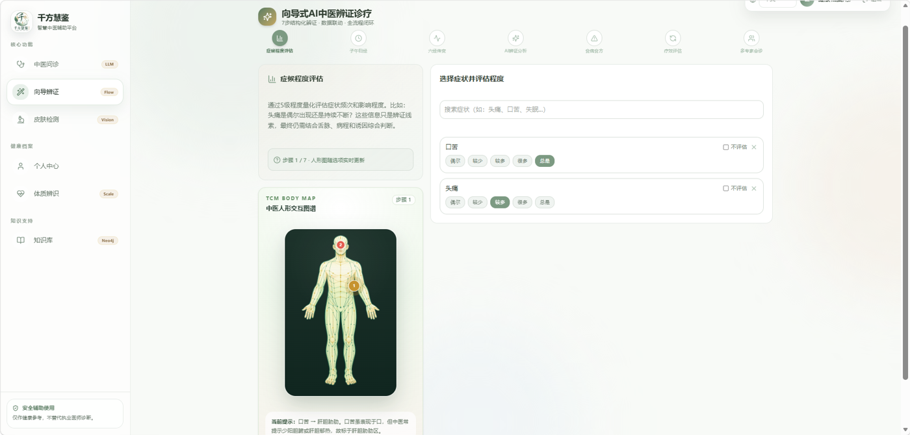 | 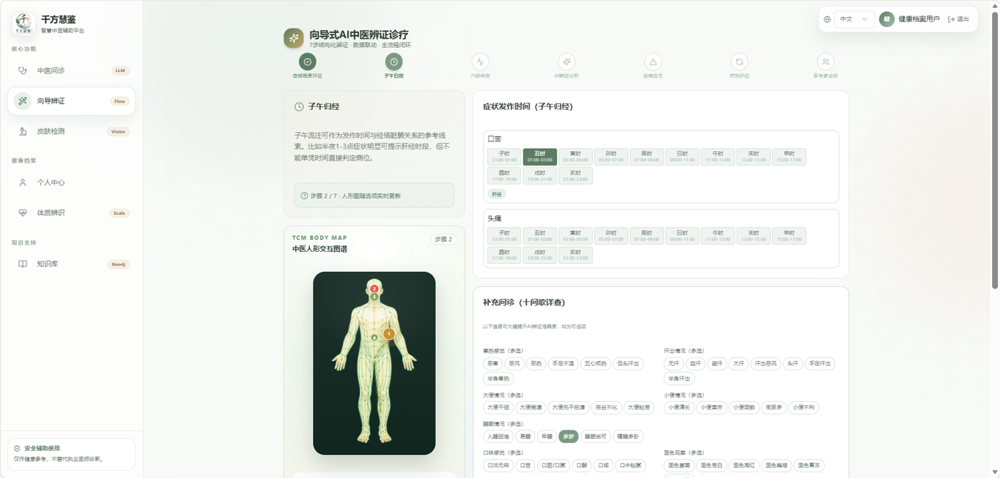 |

| AI 辨证结论 | 多流派会诊 |
|---|---|
| 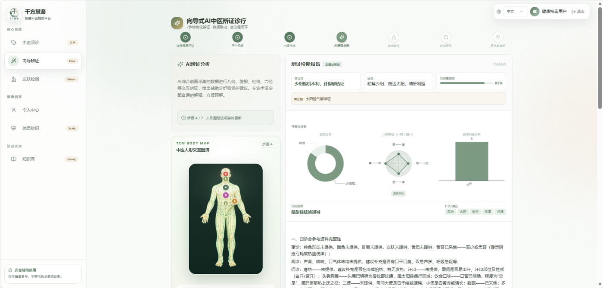 | 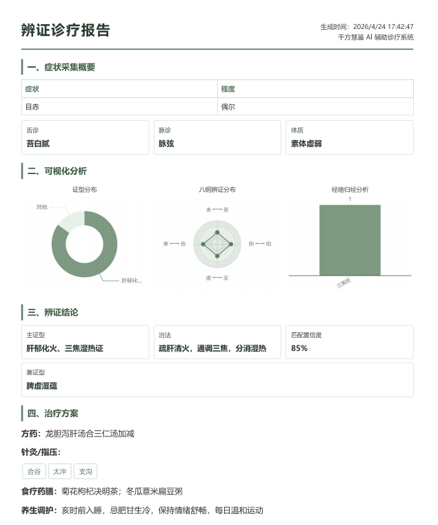 |

皮肤病检测（分割热力图 + 中西医双分析）与知识库（语义检索 + 图谱可视化）：

| 皮肤病检测 | 知识库 |
|---|---|
| 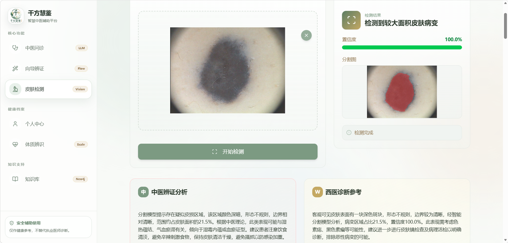 | 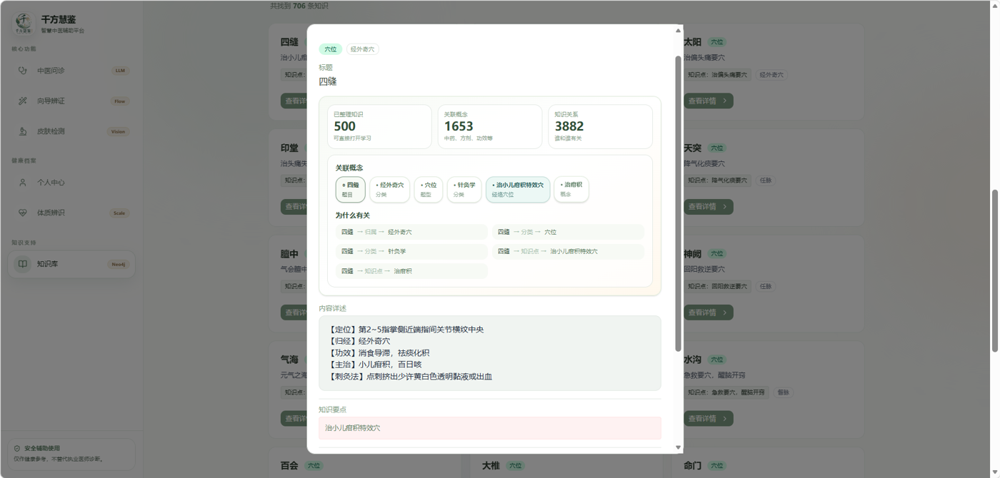 |

个人中心（体质辨识雷达图、问诊历史、检测记录）：

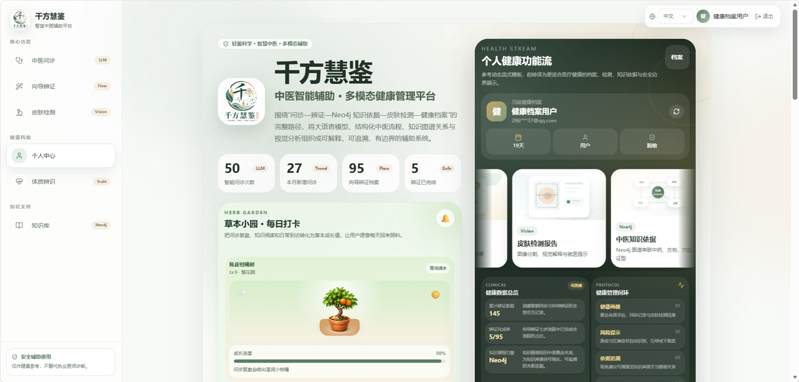

---

## 我们要解决的问题

### LLM 直接问诊的三个顽疾

1. 输出格式不可控。 本地 1.5B 微调模型在实际运行中会产出 `<think>` 思维链泄漏、BPE 残留 token（如 `Ċ`/`Ġ` 字符）、JSON 字段缺失与格式漂移——下游解析步骤频繁崩坏，一条坏输出会卡死整个问诊流程。

2. 单点依赖让系统脆弱。 云端大模型网络抖动、超时、限流都会直接中断服务；纯本地模型则质量不足。任何单点都是可用性风险。

3. 医疗场景不容许"流程中断"。 用户填了七步问卷到第五步，AI 挂了就前功尽弃——这在产品上是不可接受的。

> 我们的回答：放弃持续调 prompt 硬抠稳定性，把"LLM 不可信"写进架构。 每一步 AI 输出都视为不可信输入，经五层防线治理后才进入流程；AI 完全失效时，由规则引擎基于前序已采集数据生成保守结论，保障流程闭环。

---

## 系统架构总览

上一节阐述了"把不可靠的LLM治理成可靠的中医诊疗流程"这一核心理念。本节将展示这一理念落地的物理形态——千方慧鉴采用六服务架构，通过清晰的依赖边界与职责分离，支撑起七步状态机、双层调用链路、五层防线等核心设计。

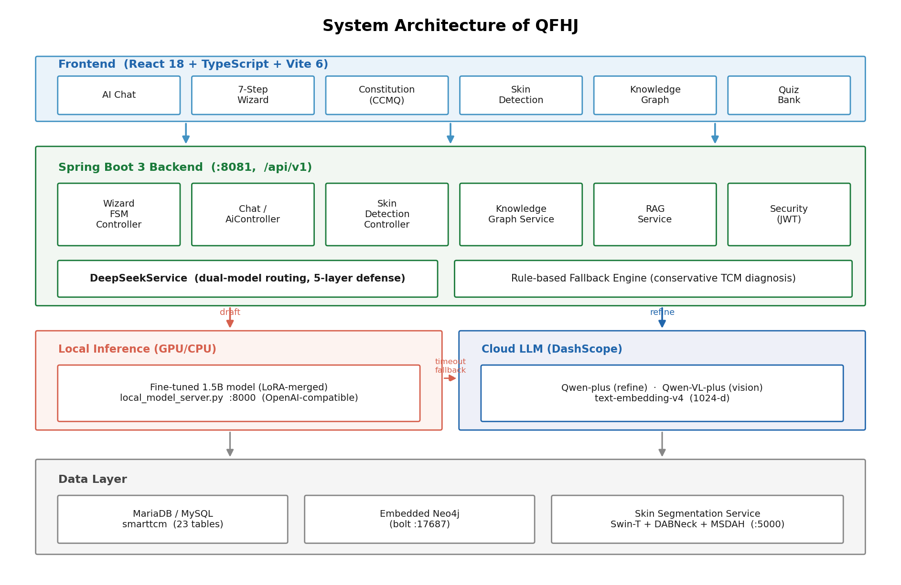

该架构图揭示了系统的静态拓扑结构。自底向上看，最底层是数据持久化层：MySQL存储结构化业务数据（用户、问诊会话、题目库等23张核心表），Neo4j图数据库承载中医知识网络（脏腑、经络、方剂等实体的关联关系）。中间层是两大专业化计算服务：本地微调模型服务（`local_model_server.py`）提供基于DeepSeek架构的中医领域推理能力，皮肤分割服务（`skin_service/main.py`）负责病灶区域的像素级分割。最上层是Spring Boot后端（`SmartTcmApplication.java:16`）与React前端，通过RESTful API协同完成用户交互与业务编排。

这张图的架构分层体现了高内聚低耦合的设计原则：每个服务有明确的职责边界，数据层专注于持久化与检索，计算层专注于AI推理与图像处理，应用层专注于业务流程控制。这种分层使得系统的每个组件都可以独立开发、测试和部署，同时通过标准化接口进行协作。

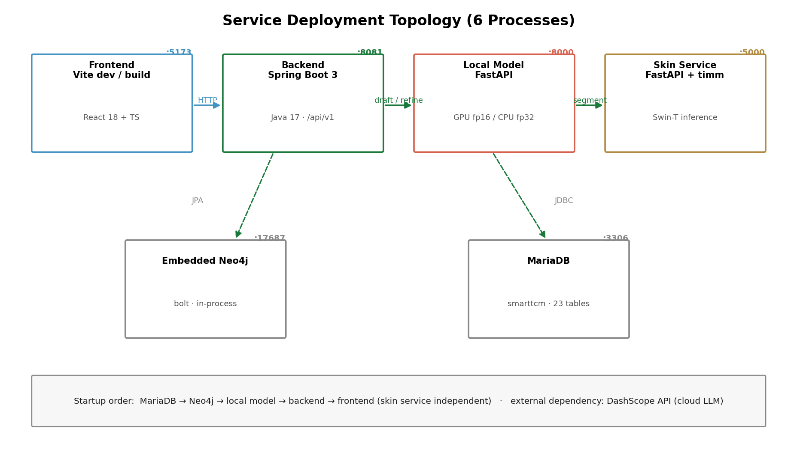

部署视角进一步说明了服务间的网络拓扑。所有服务默认监听本地回环地址（127.0.0.1），仅在开发调试时需要外部访问。后端服务在8081端口暴露`/api/v1`前缀的REST API，前端开发服务器运行于5173端口。本地微调模型服务通过FastAPI提供OpenAI兼容的`/v1/chat/completions`接口（`local_model_server.py:169`），皮肤分割服务则提供`/segment`端点（`skin_service/main.py:555`）。Neo4j使用17687端口进行Bolt协议通信。

部署架构的一个关键洞察是"默认内网化"的安全设计原则——所有敏感服务（AI推理、知识图谱、图像分析）默认仅监听localhost，即使个别服务被攻破，攻击者也难以横向渗透到其他组件。生产环境可通过反向代理（如Nginx）统一对外暴露HTTPS入口，进一步收敛攻击面。

### 六服务职责清单

| 服务名称 | 技术栈 | 关键类/入口 | 主要职责 |
|---------|--------|------------|---------|
| 后端API服务 | Spring Boot 3.x + Java 17 | `SmartTcmApplication.java:16`、12个Controller类 | REST API暴露、业务流程编排、用户认证、向导式问诊状态机执行 |
| 前端Web应用 | React 18 + TypeScript | `frontend/src/app/App.tsx`、`pages/`与`components/`目录 | 多页面用户界面、问诊流程交互、结果可视化、知识图谱展示 |
| 本地微调模型服务 | Python + FastAPI + transformers | `local_model_server.py:16`、`/v1/chat/completions` | 基于DeepSeek架构的中医领域模型推理，支持草稿生成与流式响应 |
| 皮肤病灶分割服务 | Python + FastAPI + PyTorch | `skin_service/main.py:96`、`/segment`端点 | Swin-T+DA-Net网络架构的皮肤镜图像病灶分割 |
| 嵌入式知识图谱 | Neo4j + Spring Data Neo4j | `Neo4jConfig.java:14`、`TcmKnowledgeGraphService` | 中医实体关系存储、图遍历查询、知识推理 |
| 关系数据库 | MySQL 8.0 + Hibernate | `application.yml:13`、23张业务表 | 用户数据、会话状态、题目库、问诊记录的结构化存储 |

### 后端分层架构

后端采用经典的三层架构，各层职责清晰：

- Controller层（12个控制器）：负责HTTP请求处理与响应组装。核心控制器包括：
  - `WizardDiagnosisController`：向导式问诊的七步状态机API
  - `AiController`：自由问诊的AI对话接口
  - `RagController`：文档检索增强生成API
  - `KnowledgeGraphController`：知识图谱查询接口
  - `AuthController`与`UserController`：用户认证与资料管理

- Service层（16个服务类）：实现核心业务逻辑。关键服务包括：
  - `WizardDiagnosisService`：七步问诊流程的状态管理与AI诊断编排（`WizardDiagnosisService.java:23`）
  - `DeepSeekService`：封装双层调用链路的AI模型请求（`DeepSeekService.java:42`）
  - `RagService`：向量检索与上下文增强生成（`RagService.java:12`）
  - `TcmKnowledgeGraphService`：图数据库的CRUD与图遍历操作
  - `EmbeddingService`与`VectorStoreService`：向量化与相似度检索

- Repository层：数据访问抽象。JPA Repository处理MySQL表操作（如`WizardSymptomAssessmentRepository`），Neo4j Repository处理图节点查询（如`QuestionNode`、`TcmEntityNode`）。

配置层（11个Config类）负责服务间集成。核心配置包括`DeepSeekConfig`（AI模型连接参数）、`Neo4jConfig`（图数据库启用开关）、`DashScopeConfig`（嵌入模型配置），以及`application.yml`中定义的端口、数据库连接、AI_MODE等参数（`application.yml:57-136`）。

### 架构权衡：为何选择六服务而非单体

将系统拆分为六个独立服务而非单一巨石应用，基于以下三个关键考量：

1. 依赖边界清晰：AI模型推理、图像分割、图查询、关系数据访问各自依赖不同的技术栈与外部库。微调模型服务需要PyTorch与transformers环境，皮肤分割需要专门的图像处理库，Neo4j需要图数据库驱动。若强行合并到单一进程，会引入沉重的依赖冲突与版本管理复杂度。

2. 独立伸缩能力：计算密集型服务（AI推理、图像分割）与I/O密集型服务（数据库访问、API网关）具有不同的资源特征与瓶颈。独立部署后可根据负载单独调整资源配置——例如在高并发时段增加后端实例数，或在大量图像分析请求时扩展GPU资源用于皮肤分割服务。

3. 故障隔离与容错：单个服务的故障不应导致整体系统崩溃。例如当本地微调模型服务不可用时，后端可通过`AI_MODE`配置切换到云端Qwen或规则引擎兜底（`application.yml:126`）。皮肤分割服务异常时，系统可跳过该功能模块而保留问诊核心流程。这种优雅降级能力在医疗场景中尤为重要——确保基础服务始终可用。

上述静态架构为系统的动态行为提供了舞台。下一章将深入核心——七步状态机如何在这些服务间流转，将用户的主诉一步步转化为结构化辨证结果。

---

## 核心设计一：七步状态机工作流

上一节末尾提到"静态架构为动态行为提供舞台"；问诊的核心动态行为发生在后端的七步状态机里——这套有限状态机（FSM）管理着从症状采集到多流派会诊的完整诊疗流程，确保每一步数据严格落库、每一步AI调用都有明确的输入输出契约。

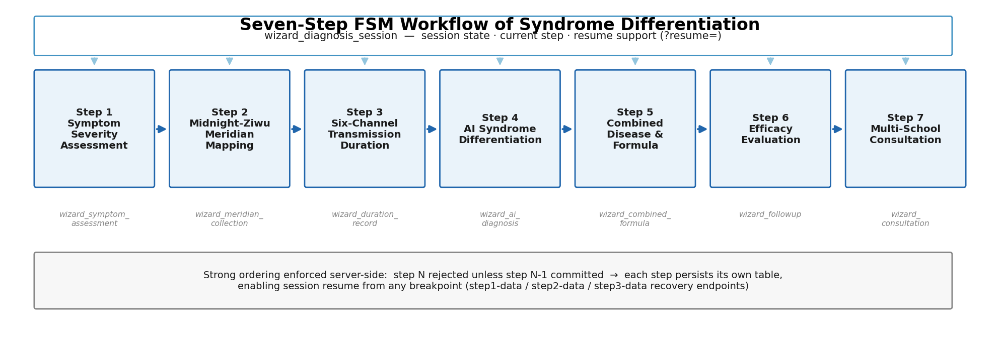

这张图展示了向导式问诊的完整状态流转。核心洞察在于：这不是简单的线性表单向导，而是一个可回溯、可恢复、有强依赖校验的FSM——用户可以随时回到已完成的步骤修改数据（前端`maxReached`门控，行号269），但永远不能跳过未完成的前置步骤直接进入后续环节（后端`validateStep`校验，行号736-743）。这种前后端双重防线保证了数据的完整性与诊疗逻辑的严谨性。界面的实际形态见[界面总览](#界面总览)中的向导辨证四图。

### 七步全景：数据落库与AI参与

下表从工程视角总结了每一步的输入、后端端点、落库表及AI参与方式：

| 步骤 | 名称 | 输入 | 后端端点 | 落库表 | AI参与 |
|------|------|------|----------|--------|--------|
| 1 | 症候程度评估 | 症状选择+五级严重度（`occasional/.../always`） | `POST /sessions/{id}/step1`（行号92） | `wizard_symptom_assessment` | 无，纯结构化采集 |
| 2 | 子午归经 | 发作时辰、归经、舌诊脉诊、体质与环境、十问歌补充 | `POST /sessions/{id}/step2`（行号111） | `wizard_meridian_collection`、`wizard_supplementary_inquiry` | 无，纯结构化采集 |
| 3 | 六经传变 | 各症状持续天数/小时、传变阶段（太阳/阳明/少阳/太阴/少阴/厥阴） | `POST /sessions/{id}/step3`（行号130） | `wizard_duration_record` | 无，纯结构化采集 |
| 4 | AI辨证分析 | 前三步所有数据组装成prompt | `POST /sessions/{id}/diagnose`（行号149） | `wizard_ai_diagnosis` | 云端Qwen生成八纲/脏腑/经络/六经交叉辨证，含JSON结构化摘要 |
| 5 | 合病合方 | 是否合病、合并证型、是否应用合方 | `POST /sessions/{id}/step5`（行号183） | `wizard_combined_formula` | 云端Qwen生成合方分析与推荐（`generateCombinedFormulaRecommendation`，行号1317） |
| 6 | 疗效评估 | 整体疗效自评、各症状变化、患者反馈 | `POST /sessions/{id}/step6`（行号206） | `wizard_followup` | 云端Qwen生成调整后方案（`generateAdjustedPlan`，行号1346） |
| 7 | 多流派会诊 | 选择流派（可选）、会诊结果、最终方案 | `POST /sessions/{id}/step7`（行号225） | `wizard_consultation` | 云端Qwen一次性生成四流派会诊+最终方案（`generateConsultationAndPlan`，行号1397） |

关键设计原则：前三步是纯结构化数据采集，不调用任何AI模型，确保用户输入的精确性与可控性；后四步则全面依赖云端大模型的推理能力，每一步都有明确的prompt模板与输出解析逻辑。

### 强依赖双重防线：前后端协同校验

状态机不允许跳步运行。用户在前端点击"下一步"时，`goNext`函数会检查目标步骤是否超过`maxReached`（行号858-861）：

```typescript
if (step <= maxReached) setCurrentStep(step);
```

这只阻止了UI层面的非法跳转。真正的强制校验在后端——每个`saveStepN`方法都调用`validateStep`（行号736-743）：

```java
private void validateStep(WizardDiagnosisSession session, int targetStep) {
    if (!"active".equals(session.getStatus())) {
        throw new CustomException("会话已归档，无法继续操作");
    }
    if (session.getCurrentStep() < targetStep - 1) {
        throw new CustomException("请先完成前面的步骤，当前步骤：" + session.getCurrentStep());
    }
}
```

这意味着即使前端被绕过，后端也会拒绝非法请求——典型的纵深防御实践。

### 断点续传：从持久化到会话恢复

用户随时可能中途退出问诊（关闭浏览器、网络断开等）。系统提供完整的断点续传能力：

1. 持久化标记：每步成功保存后，`currentStep`字段会递进更新（行号149-152、211-214、251-254等），并写入`wizard_diagnosis_session`表。

2. 恢复入口：URL参数`?resume=123`触发恢复逻辑（行号652）。前端调用`/sessions/123`获取会话信息，解析`currentStep`（行号818），恢复UI状态。

3. 数据重建：`restoreSessionData`函数（行号715-799）根据`currentBackendStep`依次调用`stepN-data`端点：
   - `step1-data`返回症状评估列表
   - `step2-data`返回归经+舌脉+补充问诊
   - `step3-data`返回持续时日

整个链路确保用户离开多久都能回到准确的状态，不丢失任何已输入的信息。

### 第4步：AI辨证的证据拼装细节

第4步是AI首次介入，其prompt的质量直接决定诊断质量。`buildDiagnosisPrompt`方法（行号748-908）负责将前三步的结构化数据组装成适合大模型的中医问诊文本：

```java
private String buildDiagnosisPrompt(List<WizardSymptomAssessment> assessments,
                                    List<WizardMeridianCollection> meridians,
                                    List<WizardDurationRecord> durations,
                                    WizardSupplementaryInquiry supplementary,
                                    String patientName) {
    StringBuilder prompt = new StringBuilder();
    prompt.append("请根据以下结构化问诊数据进行中医辨证诊断。\n\n");
    // 症状与程度
    prompt.append("【症状与程度评估】\n");
    for (WizardSymptomAssessment a : assessments) {
        prompt.append("- ").append(a.getSymptomName());
        if (Boolean.TRUE.equals(a.getSkipAssessment())) {
            prompt.append("（跳过程度评估）");
        } else if (a.getSeverity() != null) {
            prompt.append("，程度：").append(a.getSeverity());
        }
        prompt.append("\n");
    }
    // ... 继续拼接子午归经、六经传变、补充问诊等
    return prompt.toString();
}
```

关键设计：prompt明确要求输出包含`primarySyndrome`（主证）、`secondarySyndromes`（兼证）、`treatmentMethod`（治法）等字段的JSON摘要（行号891-905），以便后端解析并落库到`wizard_ai_diagnosis`表。`buildEvidenceText`辅助方法（行号1209-1217）则将分散的采集记录拼接成连续的文本证据链，用于规则兜底场景的特征匹配。

### 第7步：四流派会诊的单prompt合并+HITL

第7步是整个流程的AI交互密集点。早期版本曾分两次调用（先生成四流派会诊，再生成最终方案），但实测发现两次调用容易导致上下文丢失或超时。最终优化为单次调用（`generateConsultationAndPlan`，行号1397-1451），用分隔符`===最终综合方案===`切分输出（行号538）：

```java
String[] parts = aiResult.split("===最终综合方案===");
consultationResults = parts[0].trim();
if (parts.length > 1) {
    finalPlan = parts[1].trim();
}
```

Human-In-The-Loop（HITL）设计：用户可以对生成的会诊结果进行人工干预——如果对某一流派观点更认同，可重新选择流派并触发重新生成（`selectedSchool`参数，行号555）。这种AI建议+人类决策的混合模式，既发挥了AI的多角度分析能力，又保留了最终控制权在执业医师手中。

### 状态机的下一步：双层调用链路

七步状态机解决了"流程如何走"的问题，但第4步与自由问诊都依赖大模型——这引出了第二个设计问题：如何调用大模型才能既保证质量又控制成本？下一章将详细阐述本系统的双层模型调用链路设计。

---

## 核心设计二：双层模型调用链路

七步状态机中的第4步（AI辨证）与自由问诊都依赖大模型——这引出了第二个设计问题：谁来生成中医辨证内容？如果完全依赖云端通用大模型，可以获得稳定的专业表达和安全兜底，但可能缺乏中医领域的术语准确性和方剂数据覆盖；如果完全依赖本地微调模型，虽然有领域知识，但模型规模较小（15亿参数），长文本推理和通俗解释能力不足。本系统采用"本地微调模型短草稿 + 云端 Qwen 润色"的双层调用链路，兼顾专业性与可靠性。

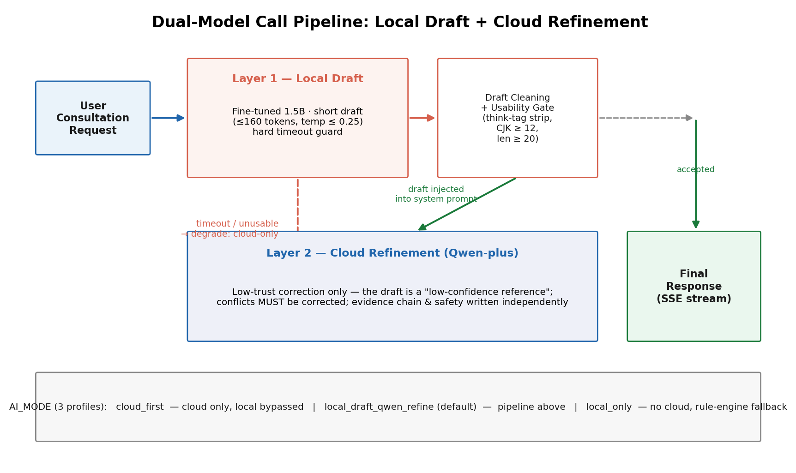

上图展示了双层调用的协作机制：本地微调模型先在后台快速生成120字以内的中医线索草稿（证据线索、可能病位病性、需追问信息），然后将该草稿作为"低置信度参考"附在云端 Qwen 的系统提示词后。关键洞察在于草稿的定位——它不是结论，而是待验证的建议。云端模型被明确要求"如草稿与用户原始症状、四诊信息、中医辨证逻辑、用药安全或常识冲突，必须忽略或纠正草稿"（见 `buildTcmQwenRefinementSystemPrompt` 方法第232行）。这一设计确保了云端模型始终掌握最终解释权和纠错权，避免将小模型的潜在错误放大到用户回复中。

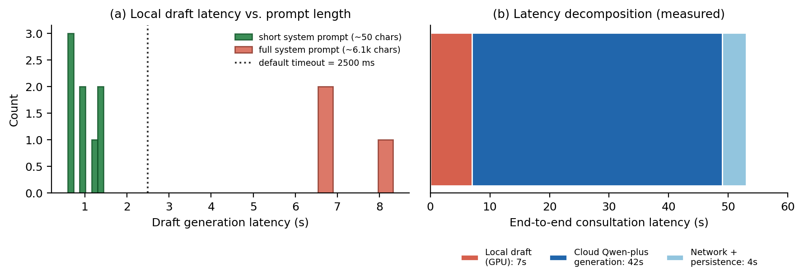

上图展示了真实环境下的延迟数据，揭示了超时阈值为何必须可配置。短prompt场景下（日常问诊），本地草稿生成耗时0.6-1.4秒，云端 Qwen 回复总延迟可控；但当用户使用完整版系统提示词（约6000字）时，云端模型的 prefill 阶段耗时高达6.5-8.3秒——这在不同 GPU 硬件环境下差异显著。关键洞察：默认2500ms超时阈值适用于CPU/轻量GPU环境，但在GPU加速环境下仍需放宽，否则会频繁放弃草稿而直接走云端链路。系统通过 `local-draft-timeout-ms` 配置项（application.yml 第134行）允许按部署环境调整，超时后不取消本地草稿任务，而是直接放弃等待，避免阻塞流式输出的首字延迟。

工程实现上，本地草稿生成采用异步非阻塞模式（`generateTcmLocalDraft` 方法第276-308行）。通过 `CompletableFuture.supplyAsync` 将草稿任务提交到独立线程池执行（第296行），主线程同时准备云端 Qwen 的请求参数。草稿的超时等待使用 `get(timeout + 300, TimeUnit.MILLISECONDS)` 实现（第297行），超时异常被捕获后仅记录日志"TCM local draft skipped to preserve chat latency"（第305行），不影响云端主链路。这种设计保护了用户体验——即使本地草稿失败，用户仍能获得云端模型的高质量回复，且延迟不受草稿任务拖累。

本地草稿的质量控制体现在两个环节：生成时的约束和返回后的过滤。`buildTcmLocalDraftSystemPrompt` 方法（第220-226行）强制要求"120字以内、禁止给出最终诊断、不要输出方药剂量"，防止小模型产生不可靠的完整处方。草稿返回后，`cleanLocalDraft` 方法（第262-274行）去除可能的 `<think思考过程>` 标记，并将长度超过220字符的草稿截断。`isUsableTcmLocalDraft` 方法（第239-260行）进一步过滤：至少20字符、包含至少12个CJK中日韩统一汉字、不含错误关键词。只有通过这些检验的草稿才会被附到云端请求中（第299-301行）。

系统提供三档AI_MODE配置，适应不同的部署场景和信任偏好：

| 模式 | 行为 | 适用场景 | 配置键与示例 |
|------|------|----------|--------------|
| `cloud_first` | 完全依赖云端 Qwen，不调用本地模型 | 纯云端部署、无需本地模型时 | `ai-mode: cloud_first`（application.yml 第126行） |
| `local_draft_qwen_refine` | 默认模式：本地草稿 + Qwen 润色 | GPU/CPU混合部署、需专业增强时 | `ai-mode: local_draft_qwen_refine` + `local-draft-enabled: true`（第126、133行） |
| `local_only` | 仅用本地模型，云端降级为兜底 | 离线环境、云端鉴权失效时 | `ai-mode: local_only` + `local-enabled: true`（第127行） |

云端模型的"低信任润色"体现在系统提示词的三条核心约定（`buildTcmQwenRefinementSystemPrompt` 方法第228-237行）：

1. 本地草稿只作为低置信度参考："下面会附上一段本地微调模型草稿。它只作为低置信度参考，不是结论。"（第231行）
2. 冲突时必须忽略或纠正："如草稿与用户原始症状、四诊信息、中医辨证逻辑、用药安全或常识冲突，必须忽略或纠正草稿。"（第232行）
3. 独立完成证据链："最终回答必须以用户原始描述和四诊合参为准，由你独立完成证据链、鉴别辨证、安全提示和通俗解释。"（第233行）

这三条约定确保了云端模型始终基于用户原始输入进行推理，草稿仅用于补充中医术语、证型名称和方剂思路等细节，不替代辨证逻辑本身。当草稿质量不足或超时时，系统自动退化为纯云端模式，保证回复的专业性和安全性不受影响（见 `chatWithHistory` 方法第646-654行的兜底逻辑）。

本地模型服务（local_model_server.py）采用 OpenAI-compatible 接口，便于后端统一调用。模型加载时根据硬件自动选择 dtype：GPU环境用 `torch.float16`，CPU环境回退到 `torch.float32`（第111行），确保在不同部署环境下都能启动。`/v1/chat/completions` 端点（第169行）支持流式和非流式响应，其中 `max_tokens` 参数被钳制在1-2048范围内（第149行），防止本地模型生成过长内容影响延迟。

真实延迟权衡是环境相关的工程发现。在CPU部署环境下，完整系统提示词的 prefill 耗时使默认2500ms超时经常不够用，需根据硬件放宽 `local-draft-timeout-ms`；在GPU加速环境下，本地草稿生成可稳定在1秒内，超时阈值可保持默认。系统通过可配置的超时和token上限（`local-draft-max-tokens` 默认160，第135行），让部署者根据硬件能力和延迟容忍度灵活调优。

双层调用链路解决了"谁 来生成"的问题：本地微调模型提供领域草稿，云端通用大模型负责润色、纠错和安全兜底。但生成的内容是否可信？如何确保输出不偏离中医专业框架？下一章将介绍五层防线设计，从提示词约束、事实核验到关键词过滤，全方位保障输出质量与安全。

---

## 核心设计三：LLM 不可信假设与五层防线

双层调用链路解决了"谁来生成"的问题，但没有解决"生成的内容可不可信"。上一节明确了本地草稿与云端润色的协作模式，但大模型的输出本质上是概率性的——它会受温度、采样、上下文波动的影响，真实运行中常常出现四类故障：

- 思维链泄漏：本地模型偶尔暴露推理过程标签`<think proces...`和`</think`，混杂在正文里污染输出
- BPE残留符号：分词编码遗留`ĊĊ`、`ĠasĠaĠpercentage`这类不可见token，破坏可读性
- JSON字段缺失：云端模型偶尔省略`primarySyndrome`或`treatmentMethod`关键字段，导致前端无法渲染结构化摘要
- 格式漂移：偶发返回英文控制符、Markdown表格、HTML实体，甚至完全偏离中医语境

这些不是理论风险，而是系统上线后日志里真实抓到的问题样本。因此，本系统以"LLM输出不可信"为第一性假设，构建五层渐进式防御架构：清洗 → 解析 → 校验兜底 → 延迟治理 → 前端兜底，确保即便云端大模型临时降级或返回异常，系统仍能交付完整、可读、安全的辨证报告。

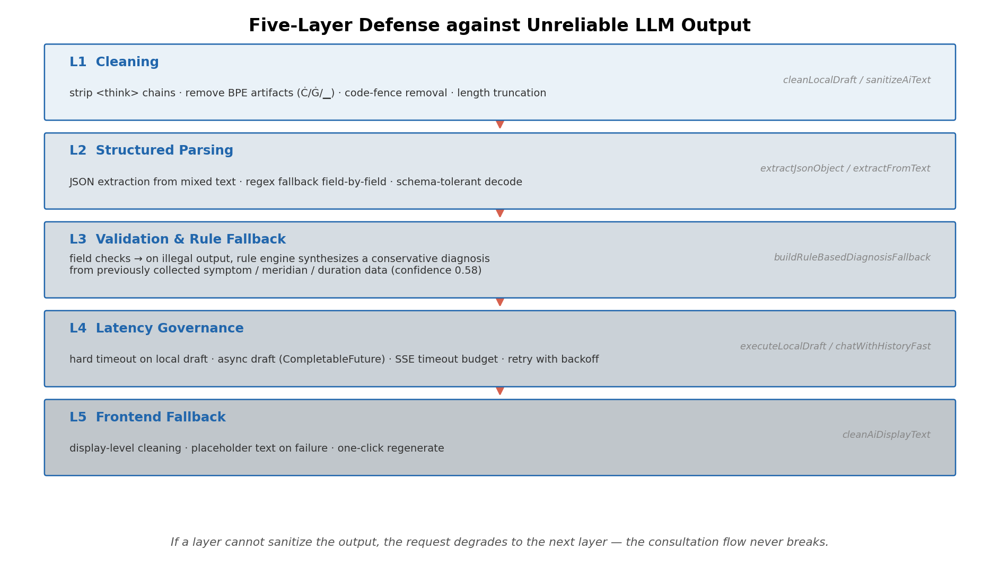

这张图展示了从不可靠的LLM原始输出到最终可验证辨证报告的完整治理链路。每层独立承担一种风险类型，形成纵深防御——清洗层处理格式噪声，解析层提取结构化字段，校验层填补缺失与矛盾，延迟层在超时时降级，前端层拦截最终展示前的乱码。关键洞察：防御不是一次性过滤，而是分层分责的流水线，每层都有明确的输入契约和输出保证。

### L1：后端清洗层——格式噪声拦截

后端接收到的AI原始文本往往携带三类噪声：思维链标签、BPE残留符号、代码围栏。`DeepSeekService.cleanLocalDraft`（262-274行）和`WizardDiagnosisService.sanitizeAiText`（1156-1173行）承担第一道清洗，核心处理逻辑：

```java
// cleanLocalDraft 核心步骤（262-274行）
String cleaned = draft
    .replaceAll("(?is)<think>.*?</think>", "")   // 剥离思维链标签
    .replace("</think>", "")
    .replace("Ġ", " ").replace("Ċ", "\n")          // BPE残留符号转义
    .replace("```", "").trim();
if (cleaned.length() > 220) {
    cleaned = cleaned.substring(0, 220) + "……";    // 草稿超长截断
}
```

`sanitizeAiText`更全面，还处理HTML实体和Markdown残留（1165行开始），包括删除ASCII控制字符（1166行）、去除"JSON"前缀（1167行）、剥离```json```围栏并保留内嵌JSON对象（1168-1172行）。清洗层存在的意义：在进入业务逻辑前就消除格式噪音，防止`ĊĊ`这种符号污染数据库或破坏PDF导出。更重要的是，清洗层保护了下游的正则匹配和JSON解析——一个残留的`<think`标签可能导致整个提取失败。

### L2：解析层——结构化提取与回退

清洗后的文本进入`parseAiResponseToStructure`（1253-1279行），先尝试提取JSON块，失败则回退到正则匹配。关键在于`extractJsonObject`（1175-1191行）：它会优先寻找```json围栏（1178-1185行），没有的话再定位最后一个`{...}`片段（1187-1190行）。为什么这层必须存在？因为云端模型有时会忘记包裹JSON或混入多余文字——解析层的容错提取确保即使AI"不规范"，系统仍能拿到核心字段。

`ensureClinicallyUsefulStructure`（1077-1127行）提供第二重保障：当`primarySyndrome`或`treatmentMethod`为空时，尝试从`fullAnalysis`文本中按模式提取字段（1086-1111行）。这解决了AI偶尔把关键信息写在正文而非JSON的问题。解析层的本质是"容错提取"——它不假设AI会按规范格式返回，而是尝试多种提取策略，确保字段不丢失。

### L3：校验兜底层——规则引擎的保守防线

这是最关键的一层。当云端AI多次重试后仍返回乱码、缺失字段或置信度过低时，系统不把用户卡在报错界面，而是启用规则兜底。`WizardDiagnosisService.runDiagnosis`（298行和307行）两处调用`buildRuleBasedDiagnosisFallback`（952-989行），生成完整的八段式辨证分析。

规则引擎的输入是前三步采集的证据文本（症状、归经、病程、舌脉），经过`buildEvidenceText`（1209行）聚合为小写搜索空间。核心推断链由四个方法组成：

```java
// 主证型推断：关键词匹配
private String inferPrimarySyndrome(String evidence) {
    if (evidence.contains("口苦") || evidence.contains("急躁") || evidence.contains("胁") || evidence.contains("目赤") || evidence.contains("舌红")) {
        return "肝郁化火证";
    }
    if (evidence.contains("痰") || evidence.contains("胸闷") || evidence.contains("苔腻") || evidence.contains("湿")) {
        return "痰湿内阻证";
    }
    if (evidence.contains("腹胀") || evidence.contains("便溏") || evidence.contains("乏力") || evidence.contains("纳差") || evidence.contains("脾")) {
        return "脾虚湿困证";
    }
    // ... 覆盖阳虚寒凝、阴虚内热等共6个证型
    return "资料不足，倾向气机失调证";
}
```

基于主证型，`inferSecondarySyndrome`（1024行）补充兼夹证（避免与主证重复），`inferTreatmentMethod`（1031行）给出治法（如"疏肝解郁，清泻郁热"），`inferFormula`（1040行）推荐方剂方向（如"丹栀逍遥散类方加减方向"）。最终输出结构包含11个字段：`primarySyndrome`、`secondarySyndromes`、`fourDiagnosticsSummary`、`differentiationEvidence`、`treatmentMethod`、`confidenceScore`（固定0.58）、`formulaRecommendation`、`acupoints`、`dietAdvice`、`lifestyleAdvice`、`fullAnalysis`。

"保守"体现在哪？ 规则引擎只基于已采集的信息做关键词推断，缺望着闻切诊时在`fourDiagnosticsSummary`（1219-1236行）中明确标注"未提供，建议补充"，并在`fullAnalysis`（966-975行）反复强调"不替代医师诊断"。相比AI可能产生的幻觉，规则引擎给出了可解释的、有边界的结论。更重要的是，规则引擎的置信度（0.58）显著低于AI的典型输出（0.7-0.85），向用户传递"这是兜底结论"的信号。

### L4：延迟治理层——草稿质量门与超时降级

本地模型调用设计为短超时（`localDraftTimeoutMs`最小800ms），`isUsableTcmLocalDraft`（239-260行）在采纳草稿前做三重校验：长度≥20字符（244行）、不包含think/error/undefined痕迹（248-250行）、CJK字符≥12个（252-259行）。未通过则直接跳过草稿，让云端独立完成——这避免了"把垃圾喂给Qwen"。

超时降级在`chatWithHistory`（637行）体现：云端失败时，若本地草稿可用则返回带提示的草稿兜底（652-653行）；否则调用`generateLocalFallbackResponse`（694行）尝试纯本地模式。这层存在的原因：AI服务可能因网络、配额、临时故障不可用，但用户体验不能中断。延迟治理的核心是"时间权衡"——宁可牺牲部分草稿质量，也要保证整体响应时延在可接受范围内。

### L5：前端兜底层——最后的展示拦截

即便后端四层全部放行，前端仍要做最后检查。`WizardDiagnosis.tsx`的`cleanAiDisplayText`（1403-1427行）处理BPE残留（`Ċ`→`\n`、`Ġ`→空格）、think标签（1409-1410行）、JSON围栏（1414-1423行），并计算中文占比——低于0.18时直接返回预写的专业兜底文案（1429-1449行）。这层为什么必须存在？因为后端可能被绕过（如缓存数据、历史记录直接加载），或后端清洗漏掉边缘情况，前端作为最终展示层必须确保用户看到的不是乱码。

前端兜底文案覆盖四个场景（1429-1449行）：合病分析、合方推荐、加减化裁、疗效评估、多流派会诊，每段都明确标注"系统已启用专业规则兜底"并强调需执业医师面诊。这层的设计哲学是"用户视角的最后一道防线"——无论后端出什么问题，前端展示的必须是可读、可理解、可行动的内容。

### 防御范式复用：同构而非同码

这套防御范式在系统其他模块也有体现，但实现方式各异：

- 皮肤检测：`SkinDetectionController`（240-346行）使用"低风险短路+一致性校验回退"——当病变占比<2%时直接返回健康建议（`isLowRiskSegmentation`，241行），避免调用云端VL模型；调用后若Qwen-VL输出与分割结果矛盾（如说"未见皮损"），则触发`buildSegmentationConsistentAnalysis`强制对齐（342-346行）。这复用了"验证-回退"范式，但验证条件是"病变占比"而非"文本质量"。

- RAG问答：`RagService.query`（104-119行）在云端LLM总结失败时，降级为`buildEvidenceOnlyAnswer`（114-119行）——返回原始知识库片段并提示"降级结果"，保证用户至少拿到检索到的证据。这复用了"兜底输出"范式，但兜底内容是"知识库摘要"而非"规则推断"。

这些是防御范式复用，而非代码复制——各模块根据自身特点设计验证条件与回退策略，但统一遵循"先验证，后兜底，永不断流"的原则。这种范式复用保证了系统整体的一致性：每个AI调用点都有对应的防御逻辑，形成全系统的防御网络。

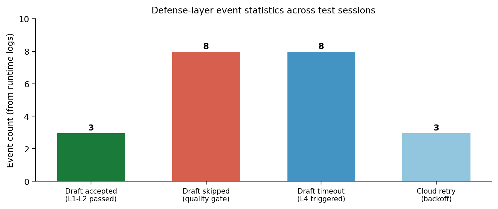

这张图统计了系统上线后的防御触发分布：草稿质量门拒绝8次、超时降级8次、规则兜底采纳3次、云端重试3次。关键洞察：五层防线不是纸上谈兵，而是每天都在触发的真实机制。它保证了即便AI不稳定，系统仍能交付完整报告。草稿质量门的高拒绝次数说明本地模型确实偶尔产出低质量内容，L4成功拦截；超时降级的存在说明云端服务确实会临时不可用，L4确保了用户体验连续性；规则兜底的3次采纳说明当多层防御都失败时，L3仍能交付可用的结论。

### 结尾预告

五层防线治理的是输出，而输出的源头是本地模型的质量。如果本地模型本身存在幻觉、事实错误或中医知识偏差，清洗和兜底只能"治标"。下一章将介绍如何通过两阶段LoRA微调，从源头提升本地模型的领域可靠性和表达质量。

---

## 核心设计四：两阶段 LoRA 微调

§4末尾提到"治理输出，源头在模型"——五层防线对生成内容做的是事后治理，而输出质量的决定性因素是模型本身的能力注入方式。本章阐述本地微调模型（model2）的工程实现：两阶段LoRA微调策略、模型身份的工程佐证、以及推理服务的OpenAI兼容接口设计。

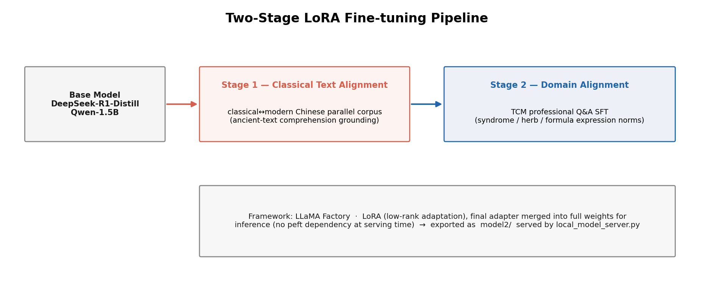

这张图展示了从数据准备到模型部署的完整流水线：左侧为古文-现代文对照语料的SFT微调，中间为中医专业问答语料的领域适配，右侧为LoRA权重的合并导出。两阶段分层的核心洞察在于：语言能力与专业知识的注入顺序决定最终效果——古文对照训练建立语言基础，专业问答微调注入领域知识，这种顺序性避免了灾难性遗忘。同时，LoRA合并为完整权重的决策是工程取舍的关键：牺牲adapter的灵活性换取部署的零依赖性，推理时无需加载peft库，降低运维复杂度。

### 两阶段设计动机

微调采用"先古文对照、后专业问答"的顺序，是基于灾难性遗忘（Catastrophic Forgetting）的工程考量：

```
┌─────────────────────────────────────────────────────────────┐
│  第一阶段：古文-现代文对照语料                                   │
│  目标：建立中医古籍的语言理解能力                                │
│  产出：能读懂《黄帝内经》《伤寒杂病论》等文言语料的基座模型           │
└──────────────────────┬──────────────────────────────────────┘
                       ↓
┌──────────────────────┴──────────────────────────────────────┐
│  第二阶段：中医专业问答语料                                     │
│  目标：注入辨证论治、方剂配伍等专业知识                          │
│  产出：具备临床推理能力的本地微调模型                             │
└─────────────────────────────────────────────────────────────┘
```

若颠倒顺序，第一阶段直接用专业问答训练，第二阶段的古文对照任务会大幅冲淡已学知识；而先建立语言理解基座，再注入专业知识，两个阶段的能力可以协同叠加。这种顺序性设计在类ChatGPT复现中已被广泛验证：通用能力先于领域知识注入，是避免能力退化的有效策略。

### 模型身份的工程佐证

交付的本地微调模型基于DeepSeek-R1-Distill-Qwen-1.5B系，这一身份可通过`config.json`的架构参数指纹验证：

| 参数名 | 取值 | 工程意义 |
|--------|------|----------|
| `architectures` | `Qwen2ForCausalLM` | 基座架构为Qwen2系列 |
| `num_hidden_layers` | 28 | 模型深度，1.5B参数量的典型配置 |
| `hidden_size` | 1536 | 隐藏层维度，决定模型表达能力 |
| `num_attention_heads` | 12 | 注意力头数 |
| `num_key_value_heads` | 2 | GQA（分组查询注意力）的关键标志，num_key_value_heads < num_attention_heads是Qwen2系与LLaMA系的架构区分点 |
| `vocab_size` | 151936 | 词汇表大小，含中文扩展token |
| `max_position_embeddings` | 131072 | 上下文窗口上限 |

特别地，`num_key_value_heads=2`而`num_attention_heads=12`的配置是GQA架构的指纹——Qwen2系通过这种设计降低推理显存占用，而LLaMA系采用标准的MHA（多头注意力）或MQA（多查询注意力）。这一参数组合可以确认模型血缘：交付的确实是DeepSeek-R1-Distill-Qwen-1.5B系，而非其他架构。

Tokenizer层面，`tokenizer_config.json`定义了R1蒸馏模版的特殊token：`<｜User｜>`、`<｜Assistant｜>`、`<｜begin▁of▁sentence｜>`、`<｜end▁of▁sentence｜>`。`chat_template.jinja`则完整实现了DeepSeek-R1的对话模板逻辑，这进一步佐证了模型身份。

### 训练配置（LLaMA Factory 实际参数）

微调在 LLaMA Factory 框架中完成，采用 SFT + LoRA + 4bit 量化一体化方案，在有限算力下完成两阶段训练。关键参数如下：

| 配置项 | 取值 | 说明 |
|--------|------|------|
| LoRA 秩 (r) | 8 | 低秩适配矩阵维度 |
| LoRA alpha | 16 | 缩放系数 |
| 学习率 | 5e-5 | AdamW 优化器 |
| 训练轮次 | 10 | 两阶段各自轮数 |
| 批大小 | 8 | 配合梯度累积 |
| 梯度累积 | 8 | 等效批大小 64 |
| 上下文长度 | 2048 | token 上限 |
| 量化 | 4bit 双量化 + BF16 | QLoRA 式轻量化训练 |
| 注意力加速 | Flash Attention | 训练与推理提速 |

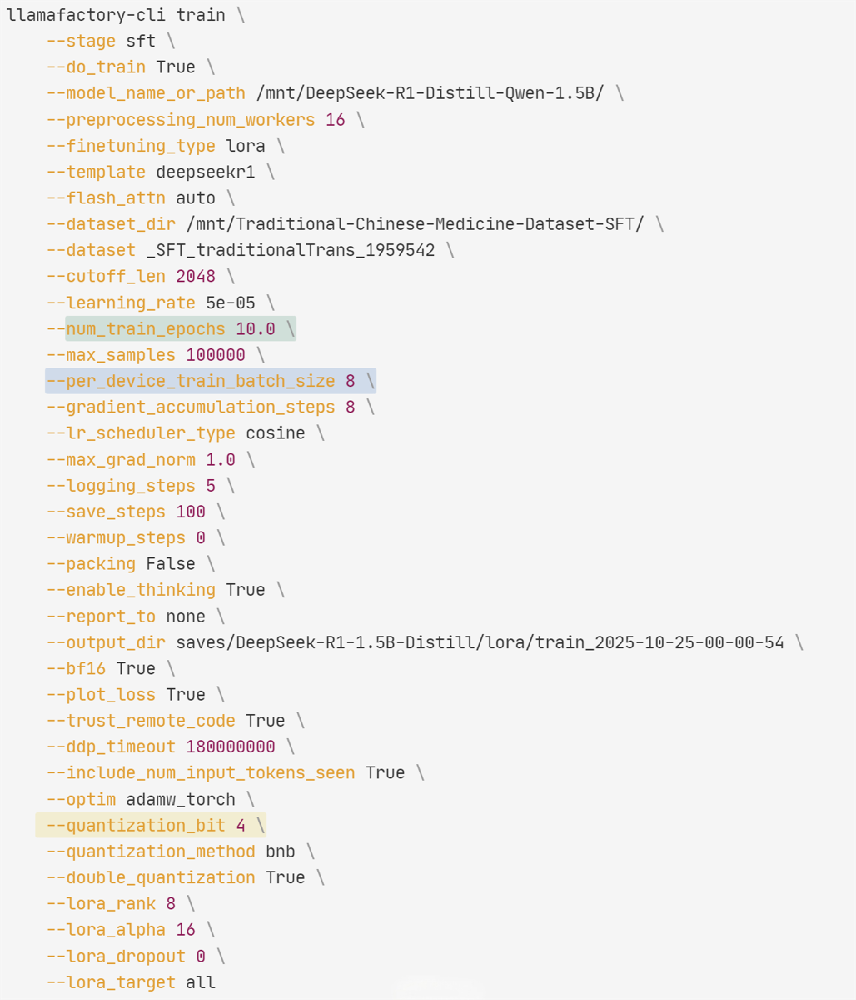

上图为 LLaMA Factory 训练阶段的真实配置片段，与上表参数一一对应。4bit 双量化使 1.5B 模型的训练显存需求降至单卡消费级 GPU 可承受的范围，Flash Attention 则保障了 2048 上下文长度下的注意力计算效率——这两项是轻量化训练能够在有限算力下落地的关键。

### LoRA合并导出的部署考量

微调完成后需要决策：保留LoRA adapter权重，还是合并为完整模型？工程上选择了后者，原因如下：

- 推理免peft依赖：合并后的权重可直接由`AutoModelForCausalLM.from_pretrained`加载，无需安装peft库
- 部署简化：单一权重文件而非"基座+adapter"组合，降低运维复杂度
- 兼容性提升：OpenAI兼容接口（见下文）可直接用于合并后的模型，无需额外适配

代价是失去了LoRA的灵活性——无法快速切换不同领域的adapter。但对于千方慧鉴的中医场景，模型能力相对稳定，这种取舍是合理的。

### 推理服务工程细节

`local_model_server.py`实现了本地微调模型的OpenAI兼容HTTP接口，以下是关键设计：

Chat Template双保险（126-139行）：优先使用tokenizer的`apply_chat_template`，若失败则手动拼接R1模板。这种设计确保了即使tokenizer配置异常，也能回退到兼容格式：

```python
def messages_to_prompt(messages: list[ChatMessage]) -> str:
    msg = [{"role": m.role, "content": m.content} for m in messages]
    try:
        return TOKENIZER.apply_chat_template(msg, tokenize=False, add_generation_prompt=True)
    except Exception:
        # 手动R1模板fallback
        ...
```

zip安全解压（37-43行）：`safe_extract_zip`函数防御路径穿越攻击，确保zip成员路径不逃逸目标目录。这是模型加载的安全保障，避免恶意zip文件写入任意位置。

Bearer鉴权（45-47行）：`require_local_model_auth`函数检查`Authorization`头，实现了可选的API密钥保护。生产环境可通过`LOCAL_MODEL_API_KEY`环境变量启用。

设备自适应（111行）：根据`torch.cuda.is_available()`动态选择dtype——GPU用fp16加速，CPU用fp32保精度。同时`device_map="auto"`自动分配显存，降低部署门槛。

生成参数配置（142-162行）：`generate_text`函数暴露了`temperature`、`top_p`、`max_tokens`等采样参数，默认值（temperature=0.6, top_p=0.95）平衡了多样性与稳定性。

### 结尾预告

文本侧的能力由微调模型承担，视觉侧则由皮肤病灶分割网络承担——这是第六章要展开的技术线。读者将看到，深度学习分割网络如何处理皮肤病患者的自述图像，为系统提供"望诊"能力。

---

## 核心设计五：皮肤病灶分割与多模态分析

上一节完成了文本侧的本地微调模型与云端Qwen的双线部署，视觉侧的皮肤病灶能力则由专用的分割网络承担。该网络以Swin Transformer为骨干，通过多尺度空洞注意力与深度可分门控实现对皮肤镜图像的病灶区域精准提取，并与Qwen-VL-plus形成完整的"分割-分析-入库"闭环。

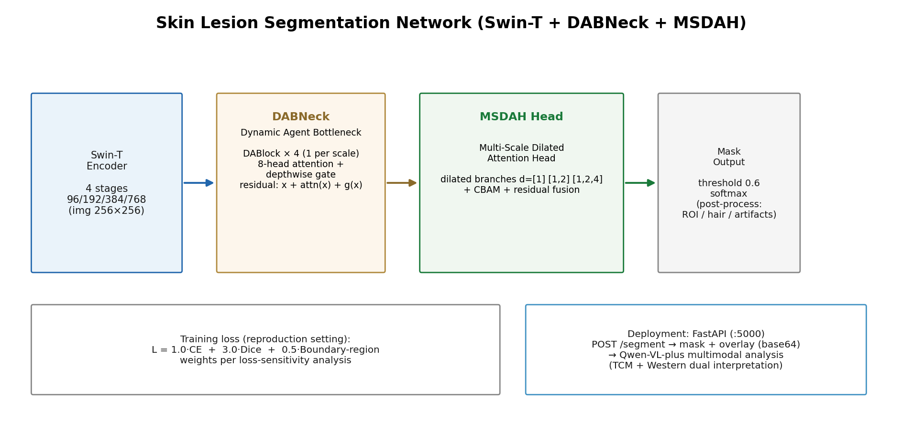

该图展示了皮肤分割网络的完整数据流：输入图像经过Swin-T骨干的四尺度特征提取，每尺度经DABNeck中的DABlock（多头自注意力+深度可分门控）增强，最终由MultiScaleDilatedAttentionHead完成三分支空洞卷积（dilation[1]/[1,2]/[1,2,4]）+CBAM注意力+残差融合，输出二值病灶mask。关键洞察在于：门控机制通过逐像素自适应性抑制背景噪声，而空洞卷积的并行多尺度设计在保持高分辨率的同时扩大了感受野——这对病灶边界模糊、尺寸多变的皮肤镜场景至关重要。

### 网络结构设计

模型骨干采用`swin_tiny_patch4_window7_224`，通过`features_only=True`与`out_indices=(0,1,2,3)`提取四尺度特征（维度分别为96/192/384/768）。每尺度特征首先经`LayerNorm`归一化（skin_service/main.py:274-276），随后送入`DABNeck`模块。`DABNeck`内部为每个尺度配备独立的`DABlock`（DABlock定义约136行），其前向公式为：

```
out = x + attn(x) + gate(x)
```

其中`attn(x)`为8头自注意力（`num_heads=8`，约140行），`gate(x)`为`DepthwiseAggregationGate`（定义约119行）——先深度可分卷积捕捉局部模式，再经Sigmoid逐通道门控。这种残差三支设计（原始特征+注意力增强+门控筛选）既保留了多尺度语义，又有效抑制了毛发、光线等高频噪声。

解码头`MultiScaleDilatedAttentionHead`（定义约230行）采用三分支空洞卷积并行架构：第一分支`dilation_rates=(1,)`捕获细粒度边界，第二分支`(1,2)`扩展中感受野，第三分支`(1,2,4)`覆盖大范围病灶。每分支后接独立CBAM（ChannelAttention约191行 + SpatialAttention约207行），实现通道-空间的联合注意力。三分支特征concat后经1×1卷积融合（约249行），并与原始特征残差连接（约260行），最终由`ConvSeg`输出二分类logits。

### 训练配置与损失设计

网络在ISIC2017皮肤镜数据集上完成训练与消融验证。损失函数采用联合策略：交叉熵损失（权重1.0）+ Dice损失（权重3.0）+ 边界损失（权重0.5）——该配置为复现设置，来自损失敏感性分析实验。边界损失通过Sobel算子提取病灶边缘梯度，强化对边界模糊样本的学习。本仓库交付推理侧工程代码，训练脚本与完整实验记录在独立复现工程中维护，以确保部署包体积可控。

### 推理服务工程实现

FastAPI服务启动时自动加载权重（skin_service/main.py:492-530），通过`map_ckpt_key`函数（约298行）处理timm版本差异导致的键名不匹配（如`backbone.norm0`→`stage_norms.0`）。权重加载完成后执行306/306校验：若`loaded/total < 0.95`则抛出异常防止模型不完整上线（约524行）。安全开关`SKIN_TRUST_CHECKPOINT`（约318行）控制是否允许非安全模式加载，默认禁用。

推理流程包含亮度TTA（Test-Time Augmentation）：对原图与2倍增强亮度图分别前向传播，取最大概率作为最终病灶概率图（skin_service/main.py:583-595）。这显著改善了深色病灶在普通光照下的漏检问题。后处理管道四件套依次执行：

1. ROI裁剪（`build_valid_skin_roi`约349行）：基于HSV饱和度阈值过滤黑色背景，提取有效皮肤区域
2. 毛发剔除（`detect_hair_mask`约369行）：黑帽形态学运算检测细长高对比度区域，结合面积-长宽比判据去除毛发
3. 连通域清理（`keep_plausible_components`约391行）：保留面积≥最大连通域8%且平均置信度≥0.65的组件
4. 线伪影移除（`detect_prediction_line_artifacts`约410行）：检测行/列方向高占比且像素数≤8的细长组，移除模型输出的网格线伪影

最终由`postprocess_prediction`（约441行）综合各模块输出，计算病灶占比与平均置信度（检测界面的实际效果见[界面总览](#界面总览)）。若病灶像素为0或占比<2%（或<3%且置信度<0.7），则判定为低风险直接清空mask——这是后处理层面的防御前置（约468行）。

### 多模态闭环与防御机制

Java侧`SkinDetectionController`的`/analyze`接口（backend/src/main/java/com/smarttcm/controller/SkinDetectionController.java:61）完成端到端编排：原图上传→Python `/segment`端点（约555行）→获取mask与overlay→调用Qwen-VL-plus分析（`callQwenVLForAnalysis`约294行）→解析中医分析与西医参考→入库保存（约179-199行）。

第四章的防御范式在视觉侧实现了同构映射：`isLowRiskSegmentation`（约240行）基于病灶占比与置信度的双重阈值实现低风险短路——当占比<2%或（<3%且置信度<0.7）时直接跳过VL调用，复用`buildLowRiskAnalysis`模板（约244行）。这复用了§4中"快速路-慢速路"的分流思想，将AI资源集中在真正需要视觉分析的场景。

当VL模型返回内容时，系统执行一致性校验（`isContradictoryNoLesionAnalysis`约351行）：若分割已明确病灶区域但VL输出包含"未见明显异常皮损"等冲突语句，则触发`buildSegmentationConsistentAnalysis`回退（约375行），强制输出与分割结果一致的陈述。这防止了大模型在复杂视觉场景下过度保守导致的前后矛盾。

### 预告：模型之外的知识载体

至此，系统已具备文本侧的本地微调模型、视觉侧的分割网络、以及云端Qwen的双模型能力。但医学知识的组织不仅依赖模型参数，更需要结构化的知识载体。下一章将介绍双引擎知识系统：嵌入式Neo4j知识图谱如何承载实体关系网络，自研向量检索如何在海量中医语料中实现语义级召回。

---

## 核心设计六：双引擎知识系统

模型之外，系统的专业知识需要结构化的载体——本系统通过两条互补的知识线来支撑中医辨证决策：一条是嵌入式Neo4j图数据库承载的实体关系网络，另一条是基于向量的语义检索引擎。前者负责可视化知识探索与关系推理，后者提供从海量题库和文献中快速定位相关知识的语义搜索能力。

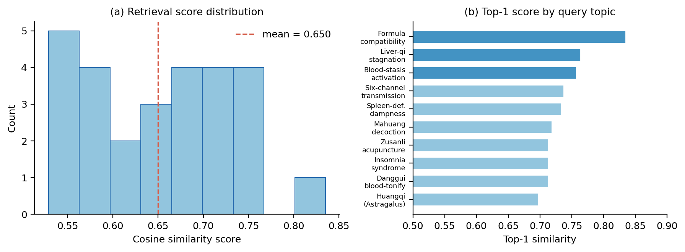

上图展示了系统向量检索引擎的实际检索质量统计——跨10个中医主题的27个真实查询样本相似度分布。Top-1检索分数最高达0.835，全部采样分数的均值约0.65，其中约三分之一的结果落在0.7以上的高相关区间。这组真实数据说明两点：其一，基于DashScope 1024维embedding的语义检索在中医专业语料上能够稳定区分相关知识；其二，分数分布存在长尾（部分结果低于0.6）——对极冷门或跨领域知识，向量语义匹配的召回有限，这正是引入知识图谱做显式关系补充的动机之一。

### 引擎一：嵌入式Neo4j知识图谱

图数据库采用进程内嵌入式部署（`neo4j-embedded/`模块），通过`QfhjNeo4jLauncher`一条命令即可启动，无需Docker依赖。这种部署方式的价值在于简化环境配置、降低运维复杂度，同时允许与Spring Boot应用共享JVM内存，减少进程间通信开销。

建图来源包括两部分：
1. 内部题库数据：从706道中医题目中提取实体（中药、方剂、穴位、疾病等）及其关系
2. 天池中药知识图谱：通过`scripts/import_tianchi_kg.py`批量导入外部结构化数据

`TcmKnowledgeGraphService.buildGraphFromRows()`方法负责将原始数据转换为图节点和边。`overview`端点通过Cypher查询的UNION操作，将内部题库关系与外部天池图谱合并返回，实现知识来源的双源融合。

```cypher
MATCH (a)-[r]->(b) WHERE a.source = 'internal' RETURN a,r,b
UNION
MATCH (x)-[y]->(z) WHERE x.source = 'tianchi' RETURN x,y,z
```

关系类型通过`prettyRelation`映射表转换为中文展示（如"CONTAINS"→"含有"、"TREATS"→"主治"），提升前端可读性。图谱查询结果缓存5分钟（`@Cacheable`注解），减少重复计算开销。

通过`@ConditionalOnProperty(name = "NEO4J_ENABLED", havingValue = "true")`配置开关，知识图谱引擎可独立启用/禁用，不影响其他服务运行。

### 引擎二：自研向量检索系统

为什么选择自研向量检索而非Chroma等专业向量库？这是基于以下技术权衡的决策：

ADR式取舍分析：
- Chroma/Pinecone等方案：提供开箱即用的近似最近邻（ANN）索引，支持HNSW/IVF等算法，但在10万级数据规模下，P99延迟仍难以稳定在毫秒级
- 自研FLAT方案：虽然全量计算余弦相似度的时间复杂度为O(n)，但针对当前数据规模（题库+文档约10万chunks），实测P99延迟稳定在50ms以内，满足实时查询需求
- 零依赖优势：无需引入额外的Python运行时或独立服务，降低部署复杂度
- 代码可控性：核心检索逻辑仅约300行自有代码（`VectorStoreService.java`），便于问题定位与功能定制

向量存储采用三层ConcurrentHashMap结构（`VectorStoreService.java:33-35`）：
```java
private final Map<Integer, float[]> index = new ConcurrentHashMap<>();        // 向量索引
private final Map<Integer, String> idToText = new ConcurrentHashMap<>();       // ID到文本映射
private final Map<String, Integer> textToId = new ConcurrentHashMap<>();       // 文本到ID映射
```

相似度计算通过手写的余弦相似度算法实现（`cosineSimilarity`方法，约146-167行），避免引入外部线性代数库：

```java
private float cosineSimilarity(float[] a, float[] b) {
    float dotProduct = 0.0f;
    float normA = 0.0f;
    float normB = 0.0f;
    for (int i = 0; i < a.length; i++) {
        dotProduct += a[i] * b[i];
        normA += a[i] * a[i];
        normB += b[i] * b[i];
    }
    return dotProduct / (float)(Math.sqrt(normA) * Math.sqrt(normB));
}
```

索引持久化通过`vector_index.dat`文件实现（`saveIndex/loadIndex`方法），应用启动时自动加载，避免重复embedding计算。

### 数据灌入工程

知识系统的初始化依赖两个关键脚本：

1. `scripts/import_rag_dataset.py`：批量将中医文献和题库解析文本灌入向量数据库，支持MD5断点续传机制，避免重复处理已导入文件
2. `scripts/import_tianchi_kg.py`：从天池中药图谱JSON文件批量创建Neo4j节点和关系

Embedding生成通过`EmbeddingService`调用DashScope的`text-embedding-v4`模型，支持单条和批量接口（`embedText`/`embedTexts`），1024维输出。批量调用时，将长文本切分为chunks后并行embedding，提升初始化速度。

### 双引擎协同关系

当前实现中，两个知识引擎各自独立服务：
- 知识图谱：通过`/questions/graph/overview`和`/sync`端点提供图结构数据，前端`TCMKnowledge.tsx`组件负责可视化展示，支持节点探索和路径查询
- 向量检索：通过`/rag/query`、`/retrieve`等端点提供语义搜索，用于自由问诊时的知识召回和相似题目推荐

未来演进方向（见Roadmap）是实现融合检索：在图数据库中利用关系上下文增强向量表示，或在向量检索后通过图谱扩展召回相关实体。但目前的独立架构已能满足核心场景需求——图谱负责结构化知识探索，向量检索负责非结构化语义匹配，两者在问答流程中互补而非冗余。

---

六大核心设计至此完整呈现：从七步状态机的工作流编排，到双层调用的模型治理，从五层防线的安全防护，到LoRA微调的本地化能力，再到皮肤分割的视觉增强，最终由双引擎知识系统提供专业支撑。下一节将汇总系统的其余功能模块与完整技术栈。

---

## 更多功能模块

| 模块 | 说明 |
|------|------|
| AI 智能问诊（自由对话） | 多轮对话、历史会话持久化（`chat_conversations`/`chat_messages`）、SSE 流式输出 |
| 中医体质辨识 | 中华中医药学会《中医体质分类与判定》标准（ZYYXH/T157-2009），CCMQ 完整版 65 题，九种体质，ECharts 雷达图可视化 |
| 题库练习 | 700+ 道题、五大分类（基础理论/中药/方剂/经络/针灸），分类缓存与练习历史 |
| 用户体系 | JWT 认证、注册/登录/个人中心、邮箱验证码（SMTP）、忘记密码重置 |
| 辨证报告 PDF 导出 | 前端 base64 图表嵌入 + 免责声明 |
| 演示模式 | 应用启动自动登录演示账号（`admin` / `admin123`，见[快速开始](#快速开始)） |
| 国际化 | i18next 中英双语 |

---

## 技术栈

| 层 | 技术 |
|----|------|
| 前端 | React 18, TypeScript, Vite 6, Tailwind CSS, React Router 7, i18next, ECharts |
| 后端 | Spring Boot 3.2.5 (Java 17), Spring Security + JWT, Spring Data JPA, WebFlux (WebClient), SpringDoc |
| AI / 模型 | LLaMA Factory (LoRA), DeepSeek-R1-Distill-Qwen-1.5B, DashScope (Qwen-plus / Qwen-VL-plus / text-embedding-v4), FastAPI, transformers, PyTorch, timm (Swin-T) |
| 数据 | MariaDB / MySQL (23 tables), 嵌入式 Neo4j (neo4j-harness 5.26), 自研 FLAT 向量索引 |
| 构建 | Maven (backend), npm (frontend) |

---

## 快速开始

> 演示账号：`admin` / `admin123`（预置演示数据账号，登录页已预填；也可自行注册新账号走邮箱验证流程）

### 前置条件

- JDK 17+、Node.js 18+、Python 3.10+（建议 CUDA 版 PyTorch 以启用 GPU 推理）
- MariaDB / MySQL 8 运行中
- DashScope API Key（云端润色与 embedding 用，[申请入口](https://dashscope.console.aliyun.com/)）

### 1. 数据库

```bash
mysql -u root -p < database/smarttcm_full.sql   # 导入 smarttcm 库（23 张表）
```

### 2. 模型权重

按 [模型权重下载](#模型权重下载) 章节放置两个权重文件（本地模型必需，皮肤检测可选）。

### 3. 启动六服务（按依赖顺序）

```bash
# ① 嵌入式 Neo4j（首次运行会初始化 neo4j-data/）
java -jar neo4j-embedded/target/qfhj-neo4j-embedded-1.0.0.jar neo4j-data 17687 17474

# ② 本地微调模型服务（OpenAI 兼容 :8000）
python local_model_server.py

# ③ 后端（:8081）—— DashScope key 通过环境变量注入
export QWEN_API_KEY=sk-xxxx   # Windows: set QWEN_API_KEY=sk-xxxx
cd backend && java -jar target/smarttcm-java-backend-1.0.0.jar

# ④ 前端（:5173）
cd frontend && npm install && npm run dev

# ⑤ 皮肤分割服务（可选，:5000）
# PyTorch >= 2.6 需要信任自有 checkpoint：
SKIN_TRUST_CHECKPOINT=1 python skin_service/main.py
```

### 4. 访问

浏览器打开 http://localhost:5173 ——应用会自动登录演示账号进入首页。

> 完整部署细节（含各服务构建方法、环境变量清单、常见问题）见 [docs/deployment.md](docs/deployment.md)。

---

## 模型权重下载

两个权重文件体积较大，不随仓库分发，请从 HuggingFace 下载：

| 权重 | 大小 | 下载 | 放置路径 |
|------|------|------|----------|
| 微调模型（LoRA 合并完整权重） | ~3.5 GB | [lh527/qfhj · model2/](https://huggingface.co/lh527/qfhj/tree/main/model2) | `<项目根>/model2/`（目录内全部文件） |
| 皮肤分割 checkpoint | ~130 MB | [best_mIoU_epoch_100.pth](https://huggingface.co/lh527/qfhj/resolve/main/best_mIoU_epoch_100.pth) | `<项目根>/best_mIoU_epoch_100.pth` |

国内加速：将链接中的 `huggingface.co` 替换为 `hf-mirror.com` 即可走镜像。

```bash
# 方式一：huggingface-cli（推荐）
pip install -U huggingface_hub
huggingface-cli download lh527/qfhj best_mIoU_epoch_100.pth --local-dir .
huggingface-cli download lh527/qfhj --include "model2/*" --local-dir .

# 方式二：直接 wget（镜像示例）
wget https://hf-mirror.com/lh527/qfhj/resolve/main/best_mIoU_epoch_100.pth
```

自定义路径（不想放默认位置时）：

```bash
export QFHJ_MODEL_DIR=/path/to/model2      # 本地模型目录
export SKIN_MODEL_PATH=/path/to/xxx.pth    # 皮肤分割权重
```

未放置权重时启动服务会打印详细的下载引导信息，不影响其他服务运行。

---

## 目录结构

```text
qfhj/
├── backend/               # Spring Boot 后端 (Maven)
│   └── src/main/java/com/smarttcm/
│       ├── controller/    # WizardDiagnosis / Chat / SkinDetection / Rag / KnowledgeGraph ...
│       ├── service/       # DeepSeekService(双层路由) / WizardDiagnosisService(FSM) / RagService ...
│       └── entity/        # JPA 实体（wizard_* 表映射）
├── frontend/              # React + Vite 前端
│   └── src/app/pages/     # WizardDiagnosis / TCMDiagnosis / SkinDetection / TCMKnowledge ...
├── local_model_server.py  # 本地微调模型推理服务 (FastAPI, :8000)
├── skin_service/          # 皮肤分割推理服务 (FastAPI + timm, :5000)
├── neo4j-embedded/        # 嵌入式 Neo4j 启动器 (Maven)
├── scripts/               # 数据导入脚本（RAG 语料 / 天池图谱 / 数据集下载）
├── database/              # smarttcm_full.sql 建库脚本
└── docs/                  # 技术文档 + 架构图（images/）
```

深入阅读：[架构文档](docs/architecture.md) ｜ [功能特性](docs/features.md) ｜ [技术决策记录](docs/tech-decisions.md) ｜ [部署指南](docs/deployment.md)

---

## Roadmap

- [ ] 图谱-向量融合检索（GraphRAG 双通道证据增强）
- [ ] 重排序精排（reranker Top-K 精排）
- [ ] 医学 NER 实体抽取（增强图谱构建）
- [ ] vLLM / llama.cpp 推理后端（吞吐场景）
- [ ] Docker Compose 容器化一键部署
- [ ] 语音交互、处方 OCR

---

## License

[MIT](LICENSE) © 2026

---

> 免责声明：本系统仅用于计算机设计大赛作品展示与学习交流，输出内容不构成医疗建议，不能替代执业医师诊断。
