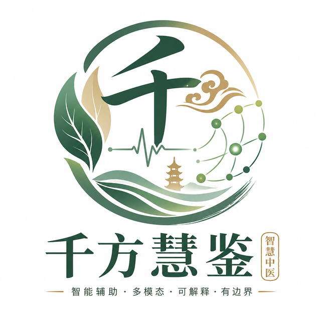

<p align="center">
  
</p>

<h1 align="center">千方慧鉴 · QFHJ</h1>

<p align="center"><strong>中医辨证 LLM Agent 问诊系统</strong></p>
<p align="center">2026 中国大学生计算机设计大赛 · 人工智能实践作品</p>

<p align="center">
  
  
  
  
  <a href="LICENSE"></a>
</p>

<p align="center">
  <a href="#界面预览">界面预览</a> ·
  <a href="#快速开始">快速开始</a> ·
  <a href="#核心设计">核心设计</a> ·
  <a href="#训练与评测">训练与评测</a> ·
  <a href="#代码导航">代码导航</a>
</p>

千方慧鉴把症候采集到辨证报告组织为七步向导流程：会话进度与各步结果落库，前端支持恢复进度和前四步数据；关键辨证输出经过清洗、结构化解析和保守兜底后再进入界面。系统还提供自由问诊、皮肤病灶分割与多模态分析，以及 Neo4j 图谱和轻量向量检索。

> **用途说明：** 本项目用于竞赛展示与技术研究。系统输出是辅助参考，不能替代执业医师的诊断、处方或治疗建议。

## 界面预览

以下截图展示登录、七步向导、皮肤检测、知识库与个人中心。

| 登录与入口 | 症候程度评估 |
|:---:|:---:|
|  |  |

| 向导流程 | AI 辨证报告 |
|:---:|:---:|
|  |  |

| 多流派会诊 | 皮肤病检测 |
|:---:|:---:|
|  |  |

| 知识库与图谱 | 个人中心 |
|:---:|:---:|
|  |  |

## 快速开始

### 环境与资源

- **基础环境：** JDK 17、Maven 3.8+、Node.js 18+、MySQL 8.0+。
- **云端模型：** 用于向导后续 AI 步骤的 DashScope `QWEN_API_KEY`。知识库嵌入服务可共用该密钥，也可单独设置 `DASHSCOPE_API_KEY`。
- **可选能力：** 本地 1.5B 模型、皮肤分割服务需要 Python 3.10+ 和对应权重；知识图谱需要启动仓库中的 Neo4j 嵌入式服务。

#### 1. 获取代码并导入演示数据

```bash
git clone https://github.com/Lh0326/qfhj.git
cd qfhj
```

`database/smarttcm_full.sql` 是完整数据库转储，**包含 `DROP DATABASE IF EXISTS smarttcm`**。请仅在空白演示环境导入，或先备份已有同名数据库。在仓库根目录运行 `mysql -u root -p`，然后于 MySQL 提示符中执行：

```sql
SOURCE database/smarttcm_full.sql;
```

#### 2. 启动最小体验

以下以 **PowerShell** 为例。先设置自己的密钥与数据库密码；`cloud_first` 会跳过本地草稿服务，`NEO4J_ENABLED=false` 会关闭知识图谱模块。

```powershell
$env:QWEN_API_KEY = "填入你的 DashScope API Key"
$env:SPRING_DATASOURCE_PASSWORD = "填入你的 MySQL 密码"
$env:AI_MODE = "cloud_first"
$env:NEO4J_ENABLED = "false"

mvn -f backend/pom.xml -DskipTests package
java -jar backend/target/smarttcm-java-backend-1.0.0.jar
```

另开终端，在仓库根目录启动前端：

```powershell
cd frontend
npm ci
npm run dev
```

访问 **http://localhost:5173**。演示账号为 `admin` / `admin123`；公共部署前请更改默认凭据并配置独立的 JWT 密钥。

#### 3. 按需启用完整能力

| 能力 | 准备与启动 | 入口 |
|---|---|---|
| 本地草稿增强 | 将[微调模型文件](https://huggingface.co/lh527/qfhj/tree/main/model2)放入 `model2/`；运行 `python -m pip install torch transformers accelerate fastapi uvicorn`；运行 `python local_model_server.py`，并将后端 `AI_MODE` 设为 `local_draft_qwen_refine` | `:8000/v1` |
| 嵌入式知识图谱 | `mvn -f neo4j-embedded/pom.xml -DskipTests package` 后运行 `java -jar neo4j-embedded/target/qfhj-neo4j-embedded-1.0.0.jar neo4j-data 17687 17474`；后端设置 `NEO4J_ENABLED=true` | Bolt `:17687` |
| 皮肤病灶分割 | 将[分割权重](https://huggingface.co/lh527/qfhj/resolve/main/best_mIoU_epoch_100.pth)放入仓库根目录；`pip install -r skin_service/requirements.txt` 后运行 `python skin_service/main.py` | `:5000/segment` |

本地模型目录可由 `QFHJ_MODEL_DIR` 指定，分割权重可由 `SKIN_MODEL_PATH` 指定。PyTorch 2.6+ 加载自有旧格式 checkpoint 时，按服务提示设置 `SKIN_TRUST_CHECKPOINT=1`。各服务启动命令应分别在独立终端运行。

## 核心设计

### 系统架构与七步工作流


前端负责采集与呈现；Spring Boot 后端编排问诊、会话和 AI 调用；MySQL 保存业务状态。本地模型、皮肤分割和嵌入式 Neo4j 均以独立服务接入，图谱通过 Bolt 与后端通信。

<details>
<summary>查看服务部署拓扑</summary>


</details>


| 步骤 | 处理内容 | 持久化结果 |
|---|---|---|
| 1 · 症候程度评估 | 选择症状并记录程度 | 症状评估 |
| 2 · 子午归经 | 记录时辰、经络、舌脉与补充问诊 | 归经与补充信息 |
| 3 · 六经传变 | 记录病程持续时间与阶段 | 病程记录 |
| 4 · AI 辨证 | 综合前三步数据，提取主证、兼证与治法 | 结构化辨证 |
| 5 · 合病合方 | 结合已有辨证分析合病与方剂方向 | 合方结果 |
| 6 · 疗效评估 | 记录症状变化与反馈 | 随访结果 |
| 7 · 多流派会诊 | 单次生成多流派观点与综合方案 | 会诊及最终方案 |

后端按会话进度限制越级调用，并保存各步结果；前端依据会话 ID 恢复进度与前四步数据。第七步将会诊与综合方案合并为一次模型调用，界面提供人工触发的重新生成入口。实现可从 [WizardDiagnosisService](backend/src/main/java/com/smarttcm/service/WizardDiagnosisService.java)、[WizardDiagnosisController](backend/src/main/java/com/smarttcm/controller/WizardDiagnosisController.java) 和 [WizardDiagnosis.tsx](frontend/src/app/pages/WizardDiagnosis.tsx) 查看。

### 双层模型调用与输出治理


自由问诊与向导中的 AI 辨证可先由本地 1.5B 微调模型生成短草稿。后端检查草稿长度与异常内容，再把合格草稿作为**低置信度线索**交给 Qwen；最终回复仍以用户原始描述和四诊信息为准。默认本地请求超时配置为 `2500ms`，草稿无效或等待超时便跳过草稿继续云端请求，控制本地推理对响应延迟的影响。相关代码见 [DeepSeekService](backend/src/main/java/com/smarttcm/service/DeepSeekService.java)。


| 层 | 针对的问题 | 当前实现 |
|---|---|---|
| 清洗 | `<think>`、BPE 残留、代码围栏等 | 清理草稿与诊断文本 |
| 结构化解析 | JSON 字段缺失或格式漂移 | 提取 JSON，回填主证与治法等关键字段 |
| 校验与规则兜底 | 第 4 步诊断输出不可用 | 根据已采集的症状、归经和病程生成保守的完整结构 |
| 延迟治理 | 本地草稿过慢或质量不足 | 跳过草稿，继续云端链路 |
| 前端兜底 | 已保存文本仍不可读 | 展示前清洗并提供可读提示 |

同一“先验证、再回退”的原则也用于皮肤分析与 RAG：前者会检查分割结果和 Qwen-VL 文本是否矛盾；后者在生成失败时返回已检索到的证据。它们是各模块独立实现的容错策略。

> **当前实现边界：** `AI_MODE` 配置提供 `cloud_first`、`local_draft_qwen_refine`、`local_only` 三个取值；现有代码主要用它控制本地草稿是否参与问诊，`local_only` 尚不是七步向导的完全离线开关。向导第 4 步有规则兜底，第 5–7 步仍需可用的云端 Qwen。

### 皮肤分割与双引擎知识系统


皮肤服务以 Swin-T 提取多尺度特征，经过 DABNeck（自注意力与深度可分门控）和多尺度空洞注意力生成病灶掩码；FastAPI 将掩码及叠加图返回后端，再交由 Qwen-VL 结合图像做辅助分析。推理网络和服务位于 [skin_service/main.py](skin_service/main.py)，多模态编排与一致性检查位于 [SkinDetectionController](backend/src/main/java/com/smarttcm/controller/SkinDetectionController.java)。

| 知识引擎 | 当前用途 | 实现 |
|---|---|---|
| 嵌入式 Neo4j | 中医实体关系存储、查询与可视化 | [QfhjNeo4jLauncher](neo4j-embedded/src/main/java/com/qfhj/neo4j/QfhjNeo4jLauncher.java)、[TcmKnowledgeGraphService](backend/src/main/java/com/smarttcm/service/TcmKnowledgeGraphService.java) |
| 轻量向量检索 | 文档切块、嵌入与余弦相似度召回 | [VectorStoreService](backend/src/main/java/com/smarttcm/service/VectorStoreService.java)、[RagService](backend/src/main/java/com/smarttcm/service/RagService.java) |

两套引擎目前分别提供关系查询与语义召回；图谱和向量的融合检索列为后续方向。

## 训练与评测

### 两阶段 LoRA 微调


本地模型采用 DeepSeek-R1-Distill-Qwen-1.5B 的 Qwen2 系列架构，在 LLaMA Factory 中先用古文与现代文对照语料进行语言适配，再续接中医专业问答进行领域对齐，训练产物随后供本地推理服务加载。

| 阶段 | 数据准备规模 | 目标 |
|---|---:|---|
| 古文与现代文对照 | 约 196 万条 | 古籍表达与现代语义对齐 |
| 中医专业问答 | 约 54 万条 | 辨证、方剂等领域知识适配 |

数据量是**数据集规模**。作品报告中的 LLaMA Factory 配置包含每阶段 `max_samples=100000`；不能据此推断全部约 250 万条都参与了训练。主要配置为 LoRA `r=8`、`alpha=16`、学习率 `5e-5`、上下文长度 `2048`、4-bit 量化和 BF16。训练过程、评测与消融记录来自参赛作品报告；本仓库公开的是部署与推理代码，未包含完整训练脚本。

<details>
<summary>查看原有训练配置截图</summary>


</details>

### 作品报告记录的结果

下表页码按 PDF 阅读器显示的页数计。

| 项目 | 报告记录 | 口径 |
|---|---:|---|
| CMB 中文医学题集 | 平均嵌入相似度 `0.72`，较基座 `+0.18` | 作品报告第 38 页的语义相似度比较；非 CMB 官方准确率 |
| ISIC 2017 病灶分割 | 续训实验最优 mIoU `79.35%`；基线实验 mDice `86.76%` | 报告第 31 页表 8；两项来自不同实验记录 |
| 问诊首字响应 | 平均 `582.40ms` | 作品报告第 41 页的测试环境记录 |
| 页面加载 | 平均 `1.03s` | 作品报告第 41 页的测试环境记录 |
| 连续运行 | `72 小时` | 作品报告第 42 页的稳定性记录 |

皮肤分割训练探索包含 CE、Dice、Boundary 联合损失；报告中的边界损失消融未超过基线，因此上表未将最优 mIoU 与联合损失实验归为同一次运行。以上性能数据尚无随仓库公开的原始日志或一键复现实验脚本，应按竞赛报告的测试记录理解。

<details>
<summary>查看原有数据图（保留在仓库中）</summary>

[检索采样图](docs/images/fig8_rag_retrieval_data.png) ·
[延迟采样图](docs/images/fig9_latency_data.png) ·
[防御事件采样图](docs/images/fig10_defense_stats.png)

</details>

## 代码导航

| 目录或文件 | 内容 |
|---|---|
| [backend/](backend/) | Spring Boot API、问诊状态、模型编排与知识服务 |
| [frontend/](frontend/) | React 界面、七步向导与数据展示 |
| [local_model_server.py](local_model_server.py) | 本地模型的 OpenAI 兼容推理接口 |
| [skin_service/](skin_service/) | Swin-T 病灶分割与 FastAPI 推理 |
| [neo4j-embedded/](neo4j-embedded/) | Neo4j 嵌入式服务启动器 |
| [database/smarttcm_full.sql](database/smarttcm_full.sql) | 演示数据库转储 |
| [scripts/](scripts/) | 知识数据导入与整理脚本 |

技术栈：React 18、TypeScript、Vite、Spring Boot 3.2.5、Java 17、MySQL 8、FastAPI、PyTorch、Neo4j、DashScope Qwen。

## License

本仓库以 [MIT License](LICENSE) 开源。医疗相关内容仅供学习、研究和作品演示。
