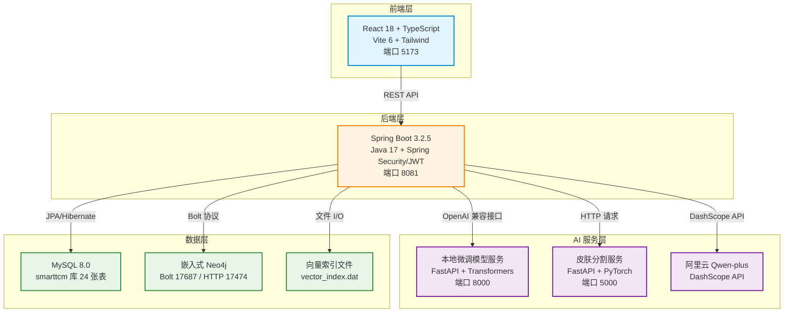
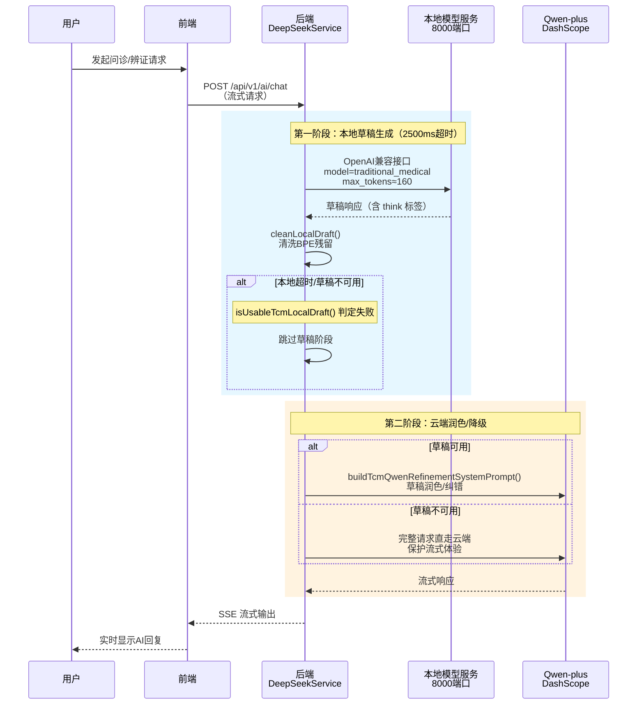
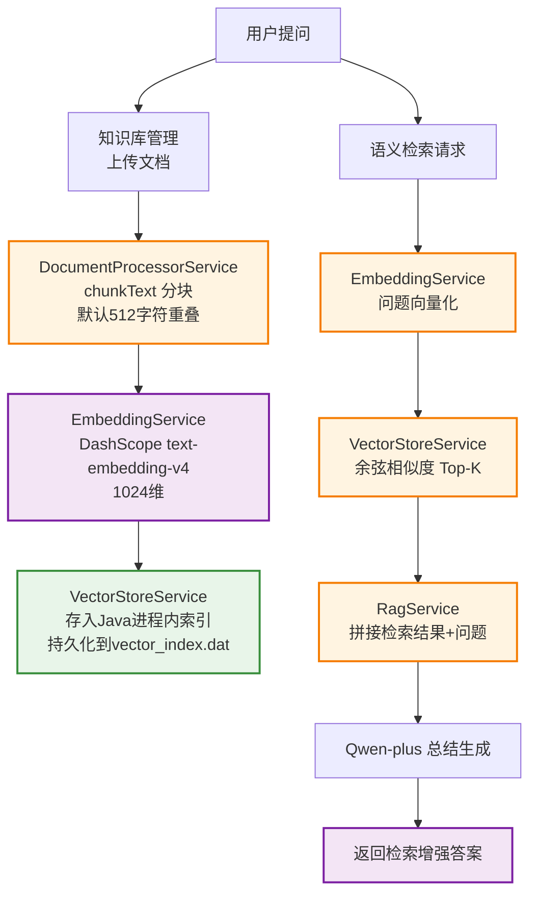
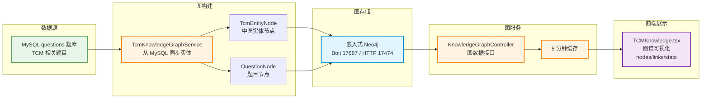
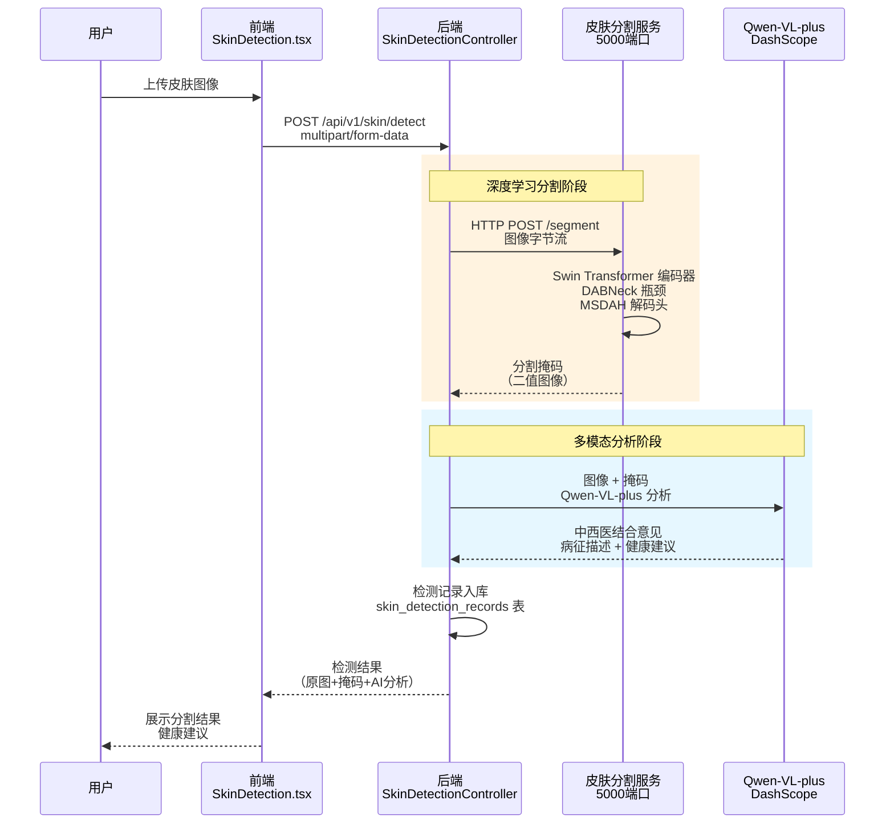
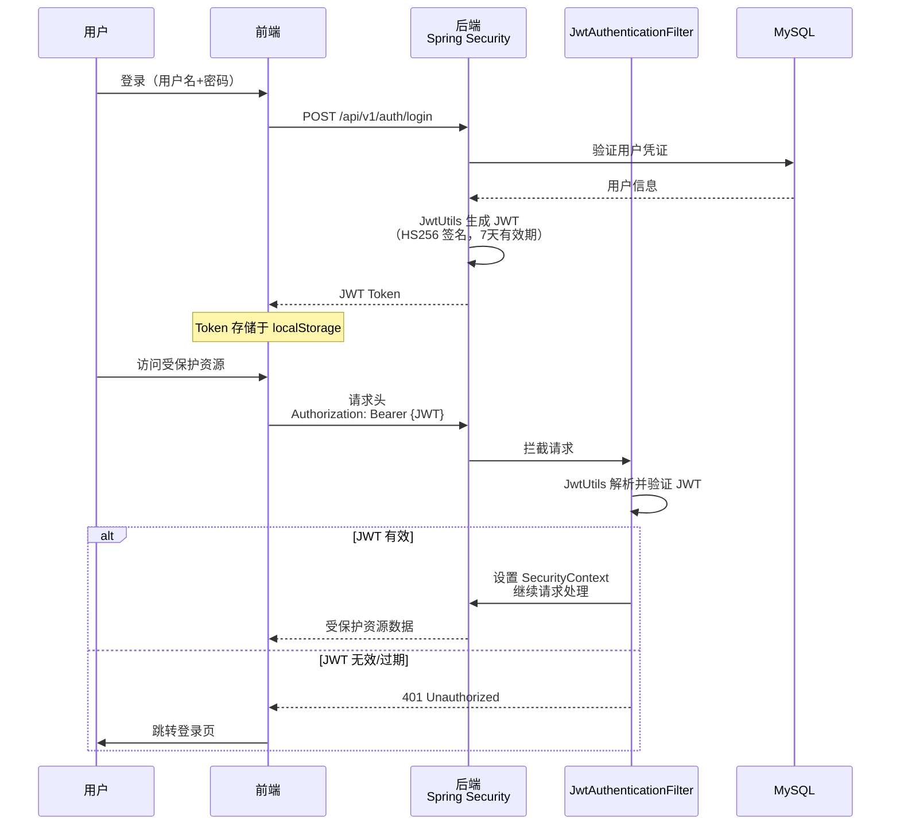

# 千方慧鉴 — 系统架构设计

本文档描述千方慧鉴智慧中医健康管理平台的系统架构、技术选型与核心链路设计。

## 总体架构

系统采用前后端分离 + 多服务协作的分布式架构，共包含 5 个独立进程：

## 五服务拓扑

| 服务 | 技术栈 | 端口 | 入口文件/命令 |
|------|--------|------|--------------|
| 前端 | React 18 + TypeScript + Vite 6 + Tailwind + React Router 7 + i18next + ECharts | 5173 | `frontend/` 目录下 `npm run dev` |
| 后端 | Spring Boot 3.2.5 (Java 17) + Spring Security/JWT + Spring Data JPA + WebFlux(WebClient) + SpringDoc | 8081 (`/api/v1`) | `backend/target/smarttcm-java-backend-1.0.0.jar` |
| 本地微调模型服务 | Python + FastAPI + transformers（OpenAI 兼容 `/v1/chat/completions`，支持 stream，可选 Bearer 鉴权） | 8000 | `local_model_server.py`，模型目录 `model2/`（DeepSeek-R1-Distill-Qwen-1.5B LoRA 微调产物） |
| 嵌入式 Neo4j | Neo4j in-process（`QfhjNeo4jLauncher`） | Bolt 17687 / HTTP 17474 | `neo4j-embedded/target/qfhj-neo4j-embedded-1.0.0.jar neo4j-data 17687 17474` |
| 皮肤分割服务 | Python + FastAPI + PyTorch + timm（Swin Transformer） | 5000 | `skin_service/main.py`，权重 `best_mIoU_epoch_100.pth` |

> 注：Neo4j 采用嵌入式部署（免 Docker、免独立安装），通过 `QfhjNeo4jLauncher` 一条命令拉起。

## AI 双层调用链路

AI 双层调用是系统的核心功能，支持三种模式：`cloud_first`、`local_draft_qwen_refine`（默认）、`local_only`。

### 模式详解

**`local_draft_qwen_refine`（默认模式）**

此模式结合本地模型的快速响应与云端模型的质量保证，提供最佳用户体验：

### 超时降级机制

- **本地超时**：2500ms 内未收到草稿响应 → 自动降级直走云端
- **草稿清洗**：去除 `` 标签、BPE 残留，通过 `isUsableTcmLocalDraft()` 判定可用性
- **云端模型**：Qwen-plus（文本）、Qwen-VL-plus（皮肤图像多模态）

### 配置项

配置位于 `backend/src/main/resources/application.yml` 的 `deepseek:` 段：

- `AI_MODE`：选择调用模式
- `local-draft-timeout-ms`：本地草稿超时时间（默认 2500ms）

详见 [tech-decisions.md](tech-decisions.md) 中关于双层调用的架构决策记录。

## RAG 知识检索链路

RAG（检索增强生成）模块提供语义检索能力，支撑 AI 问诊的知识准确性：

### 向量存储设计

- **自研轻量实现**：Java 进程内 `ConcurrentHashMap` + FLAT 索引，持久化到 `downloads/rag/vector_index.dat`
- **零外部依赖**：无需 Chroma 等外部向量数据库
- **检索方式**：余弦相似度 Top-K
- **支持功能**：文档上传（分块）、语义检索、带分数检索

> 注：当前实现未包含 bge-reranker 精排、NER 实体抽取、图谱-向量融合查询链路（图谱为独立功能）。这些功能已列入 Roadmap。

## Neo4j 知识图谱链路

知识图谱模块提供中医知识关系的可视化与查询能力：

### 图谱构建

- **数据源**：从 MySQL `questions` 题库同步实体
- **节点类型**：`TcmEntityNode`（中医实体）、`QuestionNode`（题目）
- **开关控制**：`@ConditionalOnProperty(NEO4J_ENABLED)` 可启用/禁用

### 查询与展示

- **API 接口**：`KnowledgeGraphController` 提供图数据
- **前端可视化**：`TCMKnowledge.tsx` 内嵌图谱视图（nodes/links/stats）
- **性能优化**：图谱统计 5 分钟缓存

## 皮肤检测链路

皮肤病检测采用多模态 AI 分析，结合深度学习分割与大模型视觉理解：

### 模型架构

- **编码器**：Swin Transformer（timm，Swin-T 分层 [96,192,384,768]）
- **瓶颈层**：DABNeck（动态代理瓶颈，DABlock×4 尺度，8头注意力）
- **解码头**：MSDAH（多尺度空洞分支 dilation [1]/[1,2]/[1,2,4] + CBAM + 残差）
- **损失函数**：CE + 3.0×Dice + 0.5×Boundary

### 训练数据

权重 `best_mIoU_epoch_100.pth` 在 ISIC 皮肤镜数据集上训练，训练集 mIoU 约 90%。

> 注：报告中的 "mIoU 90.3%" 为训练集评估指标，文档中表述为 "训练集上 mIoU 达约 90%"，避免误导为生产指标。

## 数据流与存储

### MySQL 数据库

MySQL 8.0 `smarttcm` 库包含 24 张表（约 844KB），按功能分组：

| 功能组 | 表名（前缀） | 用途 |
|--------|-------------|------|
| 用户认证 | `users`, `roles`, `user_roles`, `email_verification_codes` | 用户管理、权限、邮箱验证 |
| 向导辨证 | `wizard_diagnosis_sessions`, `wizard_step1_responses`, `wizard_step2_responses`, ..., `wizard_step7_responses` | 七步辨证会话状态（14张表） |
| AI 问诊 | `chat_conversations`, `chat_messages` | 多轮对话历史 |
| 知识库 | `questions`, `categories` | 题库与分类 |
| 资讯 | `news` | 中医资讯（爬虫定时任务） |
| 皮肤检测 | `skin_detection_records` | 检测记录 |
| 体质辨识 | `constitution_records` | 体质测评记录 |
| 学习统计 | `weekly_study_time_*` | 学习数据统计 |

**ORM 配置**：Hibernate `ddl-auto: update`，自动同步 DDL 变更。

### Neo4j 图数据库

- **部署方式**：嵌入式（`QfhjNeo4jLauncher`）
- **端口**：Bolt 17687 / HTTP 17474
- **数据目录**：`neo4j-data`
- **节点类型**：中医实体（`TcmEntityNode`）、题目（`QuestionNode`）

### 向量索引

- **存储路径**：`downloads/rag/vector_index.dat`
- **索引结构**：Java 进程内 `ConcurrentHashMap` + FLAT 索引
- **向量维度**：1024（DashScope text-embedding-v4）
- **检索方式**：余弦相似度 Top-K

<!-- TODO: 截图：数据库 ER 图，建议使用 MySQL Workbench 或类似工具生成 -->

## 安全与认证

### JWT 认证流程

系统采用 JWT（JSON Web Token） 无状态认证：

### 认证组件

- **`JwtUtils`**：JWT 生成、解析、验证
- **`SecurityConfig`**：Spring Security 配置，定义鉴权规则
- **`JwtAuthenticationFilter`**：请求过滤器，自动提取并验证 JWT
- **Token 有效期**：7 天

### 其他安全措施

- **密码加密**：BCrypt 哈希存储
- **邮箱验证**：QQ SMTP 发送验证码（注册、重置密码）
- **权限控制**：基于角色的访问控制（`roles`、`user_roles` 表）
- **测试账号**：admin/admin123（仅开发环境）

## 部署与启动

详见 [deployment.md](deployment.md) 完整部署指南。

## 架构演进

### 当前实现

- 向量语义检索 + Neo4j 知识图谱可视化，双引擎知识支撑
- 自研轻量向量存储（零外部依赖）
- 本地微调模型 + 云端润色的双层 AI 调用

### Roadmap

- [ ] 图谱-向量融合检索链路
- [ ] bge-reranker 精排（Top50 → Top3）
- [ ] NER 实体抽取增强图谱构建
- [ ] 容器化部署（Docker Compose）
- [ ] 语音交互、处方 OCR（需验证需求）

## 参考文档

- [功能特性](features.md)
- [部署指南](deployment.md)
- [技术决策记录](tech-decisions.md)

---

> 文档版本：v1.0
> 最后更新：2026-08-15
> 维护者：千方慧鉴开发团队
