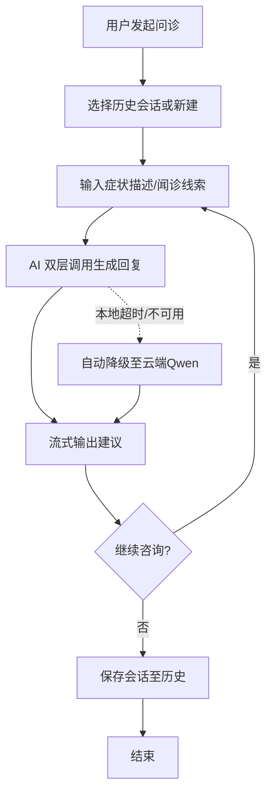
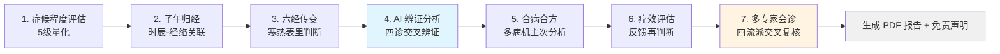
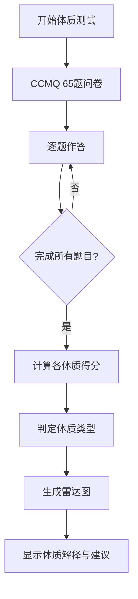
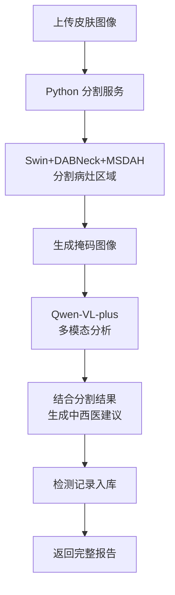
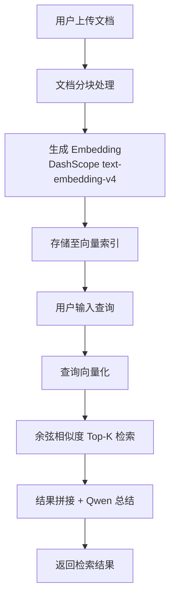
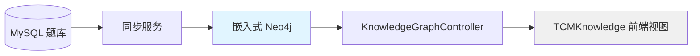
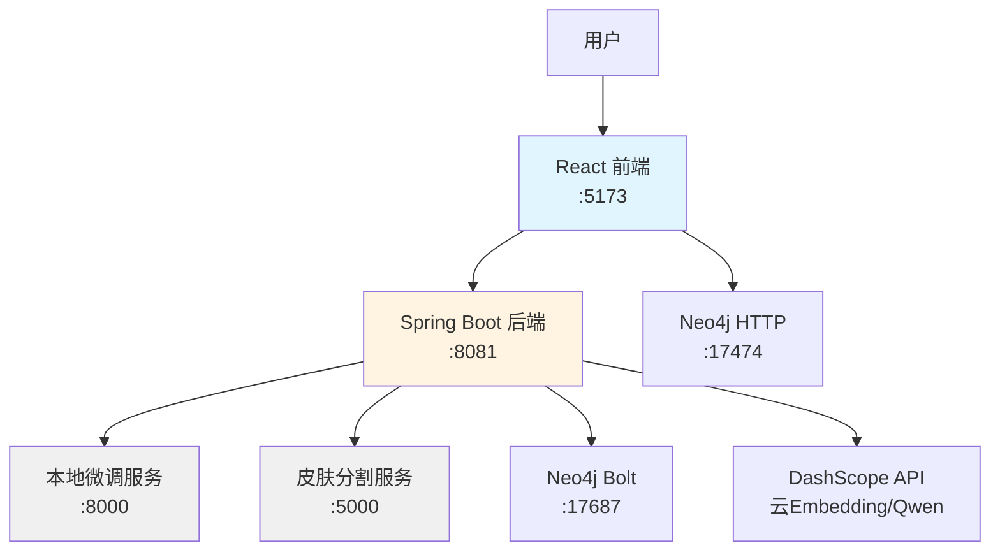

# 千方慧鉴 — 功能说明文档

本文档面向用户与评审人员，系统介绍千方慧鉴智慧中医健康管理平台的 7 大功能模块。

---

## 1. AI 智能问诊

### 功能概述
基于中医理论的多轮对话式问诊系统，支持历史会话管理、流式输出与闻诊线索输入，为用户提供初步健康咨询建议。

### 使用流程

### 技术要点
- **AI 双层调用机制**：本地微调模型（DeepSeek-R1-Distill-Qwen-1.5B LoRA）生成短草稿 → 云端 Qwen-plus 润色纠错
- **流式输出**：SSE 实时推送，提升对话体验
- **会话持久化**：chat_conversations/chat_messages 双表存储
- **闻诊支持**：专用文本输入框采集气味/声音线索
- **降级策略**：本地服务超时（2500ms）或不可用时自动直走云端，保证可用性

### 截图占位
<!-- TODO: 截图：AI 智能问诊主页面，建议截取对话区域、历史会话列表、闻诊输入框 -->

---

## 2. 七步向导式辨证

### 功能概述
系统核心功能，通过 FSM（有限状态机）引导用户完成七步辨证流程，实现八纲、脏腑、经络、六经交叉辨证，最终生成 PDF 辨证报告并提供免责声明。

### 七步流程

### 各步详解

| 步骤 | 功能 | 输入 | 输出 |
|---|---|---|---|
| 1 | 症候程度评估 | 主症、兼症、程度等级（1-5） | 量化症候矩阵 |
| 2 | 子午归经 | 发病/加重时辰、症状部位 | 经络脏腑关联线索 |
| 3 | 六经传变 | 寒热、汗出、口渴、脉象等 | 六经病势判断 |
| 4 | AI 辨证分析 | 以上三步汇总 | 八纲/脏腑/经络/六经辨证结论 |
| 5 | 合病合方 | 主病机、兼夹病机 | 合方建议、加减方案 |
| 6 | 疗效评估 | 服药后反馈、症状变化 | 病机转归判断 |
| 7 | 多专家会诊 | 完整病历数据 | 伤寒/温病/脏腑/经络四流派意见 |

### 技术要点
- **FSM 会话管理**：14 张 wizard_* 表支撑状态机，每步独立 API 端点
- **四流派专家模型**：伤寒派、温病派、脏腑辨证派、经络辨证派独立推理
- **PDF 导出**：前端 base64 图表嵌入，生成完整报告
- **免责声明**：报告末尾强制展示医疗建议免责条款

### 截图占位
<!-- TODO: 截图：七步向导主页面，建议截取七步进度条、当前步骤卡片 -->
<!-- TODO: 截图：多专家会诊页面，建议截取四流派意见对比区域 -->
<!-- TODO: 截图：PDF 报告预览，建议截取辨证结论与免责声明部分 -->

---

## 3. 中医体质辨识

### 功能概述
基于中华中医药学会《中医体质分类与判定》标准（ZYYXH/T157-2009），通过 65 题问卷评估用户体质类型，提供雷达图可视化结果。

### 使用流程

### 技术要点
- **CCMQ 标准实现**：65 题完整版问卷，九种体质判定（平和质/阳虚质/阴虚质等）
- **雷达图可视化**：ECharts 动态渲染体质得分分布
- **结果持久化**：体质记录存入数据库，支持历史对比
- **标准溯源**：明确标注 ZYYXH/T157-2009 标准编号

### 截图占位
<!-- TODO: 截图：体质问卷页面，建议截取题目展示区域与进度条 -->
<!-- TODO: 截图：体质结果页面，建议截取九种体质雷达图 -->

---

## 4. 皮肤病检测

### 功能概述
多模态皮肤病辅助检测系统，融合深度学习图像分割与大语言模型视觉分析，提供中西医结合的检测意见。

### 使用流程

### 技术要点
- **分割模型架构**：Swin Transformer 编码器 + DABNeck（动态代理瓶颈）+ MSDAH 解码头（多尺度空洞分支）
- **损失函数组合**：CE + 3.0×Dice + 0.5×Boundary 联合优化
- **多模态闭环**：分割结果作为 Qwen-VL-plus 输入上下文，提升分析准确性
- **中西医结合**：同时提供西医病理描述与中医辨证视角
- **模型权重**：ISIC 皮肤镜数据训练，训练集 mIoU 约 90%

### 截图占位
<!-- TODO: 截图：皮肤病检测上传页面，建议截取文件上传区域与使用说明 -->
<!-- TODO: 截图：检测结果页面，建议截取分割掩码可视化与 AI 分析文本 -->

---

## 5. 中医知识库（RAG 向量检索）

### 功能概述
基于向量语义检索的中医知识库系统，支持文档上传、智能分块、语义检索与 AI 总结，为用户提供精准知识查询服务。

### 使用流程

### 技术要点
- **自研向量存储**：Java 进程内 FLAT 索引（ConcurrentHashMap 实现），零外部依赖
- **分块策略**：`chunkText` 方法按段落/语义边界智能切分
- **语义检索**：DashScope 1024 维 embedding → 余弦相似度排序
- **AI 增强**：检索结果送 Qwen 总结生成自然语言答案
- **持久化**：向量索引落盘 `downloads/rag/vector_index.dat`

### 截图占位
<!-- TODO: 截图：知识库主页面，建议截取文档上传区域与检索输入框 -->
<!-- TODO: 截图：检索结果页面，建议截取相似度分数列表与 AI 总结区域 -->

---

## 6. 知识图谱可视化

### 功能概述
基于 Neo4j 的中医知识图谱系统，从题库自动同步建图，提供前端图视图与统计信息，支持关系探索。

### 技术架构

### 技术要点
- **嵌入式部署**：Neo4j in-process 模式，免 Docker、免独立安装
- **自动建图**：从 `questions` 表同步实体（TcmEntityNode/QuestionNode）
- **图视图**：前端内嵌可视化，展示 nodes/links/stats
- **缓存优化**：图谱统计 5 分钟缓存，减少查询压力
- **开关控制**：`@ConditionalOnProperty(NEO4J_ENABLED)` 灵活启用

### 截图占位
<!-- TODO: 截图：知识图谱主页面，建议截取图谱可视化网络图与统计卡片 -->
<!-- TODO: 截图：图谱节点详情，建议截取节点属性与关系列表 -->

---

## 7. 用户系统与数据看板

### 功能概述
完整的用户管理与学习统计系统，包含 JWT 认证、邮箱验证、题库练习、资讯阅读与学习数据可视化。

### 核心功能

| 功能 | 描述 |
|---|---|
| **用户认证** | JWT 令牌认证，注册/登录/个人中心 |
| **邮箱验证** | QQ SMTP 发送验证码，支持忘记密码重置 |
| **题库练习** | 中医题库分类练习，分类缓存优化 |
| **资讯爬虫** | 定时爬取中医资讯，自动入库 |
| **学习统计** | 周学习时长、练习正确率等数据可视化 |

### 技术要点
- **JWT 安全**：`JwtUtils` + `SecurityConfig` + `JwtAuthenticationFilter` 完整鉴权链
- **定时任务**：`CategoryCacheScheduler` 分类缓存，`NewsCrawlerScheduler` 资讯爬取
- **数据看板**：`WeeklyStudyTimeResponse` 聚合统计数据
- **测试账号**：admin/admin123

### 截图占位
<!-- TODO: 截图：用户登录页面，建议截取登录表单与注册链接 -->
<!-- TODO: 截图：个人中心页面，建议截取用户信息卡片与学习统计图表 -->

---

## 技术架构总览

### 服务拓扑

### 双引擎知识支撑

| 引擎 | 实现 | 能力 |
|---|---|---|
| 向量检索 | 自研 FLAT 索引 | 语义相似度查询 |
| 知识图谱 | 嵌入式 Neo4j | 关系网络探索 |

> 注：双引擎为当前独立功能，融合检索为未来演进方向。

---

## 诚实边界说明

本文档所描述功能均基于代码实际实现，以下内容未实现或不在当前范围内：

- ❌ 语音交互
- ❌ 处方 OCR 识别
- ❌ 图谱-向量融合检索（GraphRAG）

以上功能列入技术演进路线图，待后续版本迭代。

---

## 附录：技术演进方向

- [ ] 向量存储替换为 Chroma 或专业向量数据库
- [ ] 引入 bge-reranker 重排序精排
- [ ] 实现图谱-向量融合检索链路
- [ ] 增加 NER 实体抽取模块
- [ ] 容器化部署（Docker Compose + Nginx）

---

**文档版本**：v1.0  
**更新日期**：2026-08-15  
**代码仓库**：`qfhj-github`
